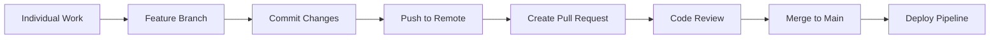

# Phase 1: Code - Collaborative Development

<div class="phase-card">
  <div class="phase-header">
    <span class="phase-title">🤝 Code Phase</span>
    <span class="workshop-status status-progress">In Progress</span>
  </div>
  <p>Learn collaborative development through Git workflows and Pull Requests</p>
</div>

<div class="workshop-callout">
  <div class="workshop-callout-title">🎯 Your First DevOps Task</div>
  <p><strong>You'll start by editing your <a href="/progress">Progress Tracker</a>!</strong> This isn't just tracking—it's practicing the Code phase through real Git workflows. Every edit teaches collaboration fundamentals.</p>
</div>

## Learning Objectives

By the end of this phase, you will:
- ✅ Understand Git branching strategies
- ✅ Create and merge Pull Requests  
- ✅ Practice collaborative code review
- ✅ **Personalize your progress tracker** (your first DevOps deliverable!)
- ✅ Set up the foundation for CI/CD

## Theory: Why the Code Phase Matters

### The Problem Without Version Control
Imagine a team working on a project where everyone edits files directly on a shared drive:
- 🚨 Conflicting changes overwrite each other
- 🚨 No history of what changed or why
- 🚨 No way to undo problematic changes
- 🚨 No coordination between team members

### The DevOps Solution: Git Workflow

The Code phase establishes **Culture** and **Sharing** from the CALMS framework:



### Key Concepts

#### 1. Branching Strategy
- **Main branch**: Always deployable, production-ready code
- **Feature branches**: Isolated development for specific features
- **Pull Requests**: Controlled way to merge changes with review

#### 2. Atomic Commits
Each commit should represent a single, complete change:

```bash
# Good: Specific, focused commits
git commit -m "feat: add user authentication form"
git commit -m "fix: resolve mobile layout issue on login page"

# Bad: Vague, mixed-purpose commits  
git commit -m "various fixes and updates"
```

#### 3. Conventional Commits
Using a consistent format helps automation and clarity:

- `feat:` - New features
- `fix:` - Bug fixes  
- `docs:` - Documentation changes
- `refactor:` - Code restructuring without feature changes
- `test:` - Adding or correcting tests
- `chore:` - Maintenance tasks (e.g., updating dependencies)

## Hands-On Practice

### Step 1: Fork and Clone
<div class="step-counter">1</div>

First, create your own copy of the workshop repository:

1. **Fork the repository**
   - Go to the workshop GitHub repository
   - Click the "Fork" button in the top right
   - Choose your personal account as the destination

2. **Clone your fork locally**

   ```bash
   git clone https://github.com/YOUR_USERNAME/devops-workshop-vitepress.git
   cd devops-workshop-vitepress
   ```

3. **Set up the upstream remote**

   ```bash
   git remote add upstream https://github.com/ORIGINAL_OWNER/devops-workshop-vitepress.git
   git remote -v  # Verify both origin and upstream are set
   ```

### Step 2: Create Your First Feature Branch
<div class="step-counter">2</div>

Never work directly on the main branch! Always create a feature branch:

```bash
# Create and switch to a new feature branch
git checkout -b feat/code-phase

# Verify you're on the new branch
git branch
```

<div class="tip-box">
💡 <strong>Naming Convention:</strong> Use descriptive branch names with prefixes like <code>feat/</code>, <code>fix/</code>, or <code>docs/</code>
</div>

### Step 3: Make Your First Changes - Personalize Your Progress Tracker
<div class="step-counter">3</div>

**This is where DevOps practice begins!** You'll edit your progress tracker to learn Git workflows:

1. **Open `docs/progress.md` in your editor**

2. **Personalize your workshop information:**

   ```markdown
   ## Personal Workshop Information

   **Participant Name:** [Your Full Name]
   **Workshop Date:** [Today's Date - e.g., January 15, 2025]
   **Learning Goal:** [e.g., "Build my first CI/CD pipeline and understand DevOps fundamentals"]
   **GitHub Username:** [your-github-username]
   **Expected Site URL:** https://[your-username].github.io/devops-workshop-vitepress/
   ```

3. **Update Phase 1 status in your tracker:**

   ```markdown
   ### Phase 1: Code - Collaborative Development 🤝

   **Completion Checklist:**
   - [x] Forked the workshop repository to my GitHub account
   - [x] Cloned my fork locally and got the site running (`pnpm dev`)
   - [x] Created my first feature branch (`feat/personalize-tracker`)
   - [x] **Edited this progress tracker** with my personal information
   - [ ] Made my first commit with a good commit message
   - [ ] Pushed my branch to GitHub
   - [ ] Created and merged my first Pull Request
   - [ ] Verified my changes are live on the main branch

   **My Code Phase Notes:**
   ```
   Started learning DevOps through hands-on practice!
   - Git workflow feels more natural now
   - Understanding how branches enable safe collaboration
   - Excited to see my changes deploy automatically later
   ```

   **Timestamp Completed:** [Leave blank for now]
   ```

4. **Save the file**

<div class="tip-box">
💡 <strong>Why This Matters:</strong> Editing your progress tracker teaches Git workflows while creating your personal learning record. This dual-purpose approach demonstrates DevOps efficiency principles!
</div>

### Step 4: Stage and Commit Your Changes
<div class="step-counter">4</div>

Now let's save your progress tracker updates to Git:

```bash
# Check what files have changed
git status

# Add your progress tracker changes to staging
git add docs/progress.md

# Commit with a descriptive message following conventional commits
git commit -m "feat: personalize workshop progress"
```

<div class="warning-box">
⚠️ <strong>Commit Message Format:</strong> The first line is a brief summary (50 chars max), followed by a blank line, then detailed explanation if needed.
</div>

### Step 5: Push Your Branch  
<div class="step-counter">5</div>

Upload your branch to GitHub:

```bash
# Push your feature branch to your fork
git push origin feat/personalize-site
```

You should see output like:

```
Enumerating objects: 5, done.
Counting objects: 100% (5/5), done.
Delta compression using up to 4 threads
Compressing objects: 100% (3/3), done.
Writing objects: 100% (3/3), 362 bytes | 181.00 KiB/s, done.
Total 3 (delta 2), reused 0 (delta 0), pack-reused 0
To https://github.com/YOUR_USERNAME/devops-workshop-vitepress.git
 * [new branch]      feat/personalize-site -> feat/personalize-site
```

### Step 6: Create a Pull Request
<div class="step-counter">6</div>

Now let's propose your changes to the main repository:

1. **Go to the Pull Requests tab** of your forked repository on GitHub
2. **Click "New Pull Request"**
3. **Select your feature branch** (`feat/personalize-site`) as the compare branch
4. **Add a title and description** for your Pull Request:
   - **Title:** `feat: personalize workshop progress tracker`
   - **Description:**

     ```markdown
     # Personal Progress Tracker

     ## Changes Made
     - Added personal information and learning goals
     - Updated Phase 1 checklist with initial progress
     - Documented first Git workflow experience

     ## Purpose
     This tracker is my first DevOps deliverable! It helps me and the instructors monitor my progress through the workshop phases.
     ```

5. **Click "Create Pull Request"**

<div class="tip-box">
💡 <strong>PR Description Tips:</strong> Use markdown for formatting, reference any related issues, and explain the "why" behind your changes.
</div>

### Step 7: Code Review and Merge
<div class="step-counter">7</div>

After creating the Pull Request:
- Request reviews from instructors or peers
- Respond to feedback and make changes if needed
- Once approved, merge the Pull Request into the main branch

<div class="tip-box">
💡 <strong>Code Review Best Practices:</strong> Review for clarity, maintainability, and adherence to project standards. Leave constructive feedback.
</div>

## Validation & Next Steps

### ✅ Success Criteria

You've successfully completed the Code phase if:
- [x] You have a merged Pull Request in your repository
- [x] **Your personalized progress tracker is visible** in the main branch
- [x] You understand the Git workflow: branch → commit → push → PR → merge
- [x] You can explain why this process promotes collaboration
- [x] **Your progress tracker shows Phase 1 as completed** with personal notes

[Continue to Phase 2: Build →](/phases/02-build)
