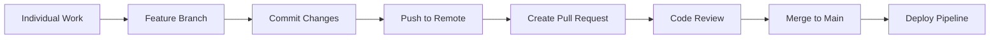

# Phase 1: Code - Collaborative Development

<div class="phase-card">
  <div class="phase-header">
    <span class="phase-title">🤝 Code Phase</span>
    <span class="workshop-status status-progress">In Progress</span>
  </div>
  <p>Learn collaborative development through Git workflows and Pull Requests</p>
</div>

## Learning Objectives

By the end of this phase, you will:
- ✅ Understand Git branching strategies
- ✅ Create and merge Pull Requests
- ✅ Practice collaborative code review
- ✅ Set up the foundation for CI/CD

## Theory: Why the Code Phase Matters

### The Problem Without Version Control
Imagine a team working on a project where everyone edits files directly on a shared drive:
- 🚨 Conflicting changes overwrite each other
- 🚨 No history of what changed or why
- 🚨 No way to undo problematic changes
- 🚨 No coordination between team members

### The DevOps Solution: Git Workflow

The Code phase establishes **Culture** and **Sharing** from the CALMS framework:



### Key Concepts

#### 1. Branching Strategy
- **Main branch**: Always deployable, production-ready code
- **Feature branches**: Isolated development for specific features
- **Pull Requests**: Controlled way to merge changes with review

#### 2. Atomic Commits
Each commit should represent a single, complete change:

```bash
# Good: Specific, focused commits
git commit -m "feat: add user authentication form"
git commit -m "fix: resolve mobile layout issue on login page"

# Bad: Vague, mixed-purpose commits  
git commit -m "various fixes and updates"
```

#### 3. Conventional Commits
Using a consistent format helps automation and clarity:

- `feat:` - New features
- `fix:` - Bug fixes  
- `docs:` - Documentation changes
- `refactor:` - Code restructuring without feature changes
- `test:` - Adding or correcting tests
- `chore:` - Maintenance tasks (e.g., updating dependencies)

## Hands-On Practice

### Step 1: Fork and Clone
<div class="step-counter">1</div>

First, create your own copy of the workshop repository:

1. **Fork the repository**
   - Go to the workshop GitHub repository
   - Click the "Fork" button in the top right
   - Choose your personal account as the destination

2. **Clone your fork locally**

   ```bash
   git clone https://github.com/YOUR_USERNAME/devops-workshop-vitepress.git
   cd devops-workshop-vitepress
   ```

3. **Set up the upstream remote**

   ```bash
   git remote add upstream https://github.com/ORIGINAL_OWNER/devops-workshop-vitepress.git
   git remote -v  # Verify both origin and upstream are set
   ```

### Step 2: Create Your First Feature Branch
<div class="step-counter">2</div>

Never work directly on the main branch! Always create a feature branch:

```bash
# Create and switch to a new feature branch
git checkout -b feat/personalize-site

# Verify you're on the new branch
git branch --show-current
```

<div class="tip-box">
💡 <strong>Naming Convention:</strong> Use descriptive branch names with prefixes like <code>feat/</code>, <code>fix/</code>, or <code>docs/</code>
</div>

### Step 3: Make Your First Changes
<div class="step-counter">3</div>

Let's personalize your workshop experience by editing your progress tracker:

1. **Open `docs/progress.md` in your editor**

2. **Add your personal information:**

   ```markdown
   # My DevOps Workshop Journey
   
   **Participant:** [Your Name]
   **Date:** [Today's Date]
   **Goal:** Learn CI/CD by building a real pipeline
   
   ## Personal Learning Tracker
   
   ### Phase 1: Code ⏳
   - [x] Forked and cloned repository  
   - [x] Created feature branch
   - [ ] Made first commit
   - [ ] Created Pull Request
   - [ ] Merged PR successfully
   
   **Notes:** This is my first DevOps workshop!
   
   ### Phase 2: Build 🔜
   - [ ] Created GitHub Actions workflow
   - [ ] Built site artifacts
   - [ ] Verified build process
   
   ### Phase 3: Test 🔜
   - [ ] Added automated tests
   - [ ] Achieved test coverage goals
   - [ ] Fixed test failures
   
   ### Phase 4: Release 🔜  
   - [ ] Created semantic version tag
   - [ ] Generated release notes
   - [ ] Downloaded release artifacts
   
   ### Phase 5: Deploy 🔜
   - [ ] Deployed to GitHub Pages
   - [ ] Verified live site
   - [ ] Completed full CI/CD pipeline
   ```

3. **Save the file**

### Step 4: Stage and Commit Your Changes
<div class="step-counter">4</div>

Now let's save your changes to Git:

```bash
# Check what files have changed
git status

# Add your changes to staging
git add docs/progress.md

# Commit with a descriptive message
git commit -m "feat: add personal workshop progress tracker

- Added personal information and learning goals
- Created structured checklist for all 5 phases  
- Documented current progress in Code phase"
```

<div class="warning-box">
⚠️ <strong>Commit Message Format:</strong> The first line is a brief summary (50 chars max), followed by a blank line, then detailed explanation if needed.
</div>

### Step 5: Push Your Branch  
<div class="step-counter">5</div>

Upload your branch to GitHub:

```bash
# Push your feature branch to your fork
git push origin feat/personalize-site
```

You should see output like:
