# Fase 1: Code - Collaboratieve Ontwikkeling

<div class="phase-card">
  <div class="phase-header">
    <span class="phase-title">🤝 Code Fase</span>
    <span class="workshop-status status-progress">In Uitvoering</span>
  </div>
  <p>Leer collaboratieve ontwikkeling via Git workflows en Pull Requests</p>
</div>

<div class="workshop-callout">
  <div class="workshop-callout-title">🎯 Jouw Eerste DevOps Taak</div>
  <p><strong>Je begint met het bewerken van je <a href="/progress">Voortgangstracker</a>!</strong> Dit is niet alleen bijhouden—het is het oefenen van de Code fase via echte Git workflows. Elke bewerking leert je samenwerking fundamenten.</p>
</div>

## Leerdoelen

Aan het einde van deze fase zul je:
- ✅ Git branching strategieën begrijpen
- ✅ Pull Requests aanmaken en mergen
- ✅ Collaboratieve code review oefenen
- ✅ **Je voortgangstracker personaliseren** (je eerste DevOps deliverable!)
- ✅ De basis leggen voor CI/CD

## Theorie: Waarom de Code Fase Belangrijk Is

### Het Probleem Zonder Versiecontrole
Stel je een team voor dat aan een project werkt waarbij iedereen bestanden direct op een gedeelde schijf bewerkt:
- 🚨 Conflicterende wijzigingen overschrijven elkaar
- 🚨 Geen geschiedenis van wat er is veranderd of waarom
- 🚨 Geen manier om problematische wijzigingen ongedaan te maken
- 🚨 Geen coördinatie tussen teamleden

### De DevOps Oplossing: Git Workflow

De Code fase vestigt **Cultuur** en **Delen** uit het CALMS framework:

```mermaid
graph LR
  A[Individueel Werk] --> B[Feature Branch]
  B --> C[Commit Wijzigingen]
  C --> D[Push naar Remote]
  D --> E[Creëer Pull Request]
  E --> F[Code Review]
  F --> G[Merge naar Main]
  G --> H[Deploy Pipeline]
```



### Kernconcepten

#### 1. Branching Strategie
- **Main branch**: Altijd deploybaar, production-ready code
- **Feature branches**: Geïsoleerde ontwikkeling voor specifieke features
- **Pull Requests**: Gecontroleerde manier om wijzigingen te mergen met review

#### 2. Atomaire Commits
Elke commit moet een enkele, complete wijziging representeren:

```bash
# Goed: Specifiek, gefocuste commits
git commit -m \"feat: voeg gebruiker authenticatie formulier toe\"
git commit -m \"fix: los mobiele layout probleem op login pagina op\"

# Slecht: Vage, gemengde commits
git commit -m \"verschillende fixes en updates\"
```

#### 3. Conventional Commits
Een consistent formaat gebruiken helpt bij automatisering en duidelijkheid:

- `feat:` - Nieuwe features
- `fix:` - Bug fixes
- `docs:` - Documentatie wijzigingen
- `refactor:` - Code herstructurering zonder feature wijzigingen
- `test:` - Tests toevoegen of corrigeren
- `chore:` - Onderhoudstaken (bijv. dependencies updaten)

## Hands-On Oefening

### Stap 1: Fork en Clone
<div class=\"step-counter\">1</div>

Maak eerst je eigen kopie van de workshop repository:

1. **Fork de repository**
   - Ga naar de workshop GitHub repository
   - Klik op de \"Fork\" knop rechtsboven
   - Kies je persoonlijke account als bestemming

2. **Clone je fork lokaal**

   ```bash
   git clone https://github.com/JOUW_GEBRUIKERSNAAM/devops-workshop-vitepress.git
   cd devops-workshop-vitepress
   ```

3. **Stel de upstream remote in**

   ```bash
   git remote add upstream https://github.com/ORIGINELE_EIGENAAR/devops-workshop-vitepress.git
   git remote -v  # Verifieer dat zowel origin als upstream zijn ingesteld
   ```

### Stap 2: Creëer Je Eerste Feature Branch
<div class=\"step-counter\">2</div>

Werk nooit direct op de main branch! Maak altijd een feature branch:

```bash
# Creëer en schakel naar een nieuwe feature branch
git checkout -b feat/code-fase

# Verifieer dat je op de nieuwe branch bent
git branch
```

<div class=\"tip-box\">
💡 <strong>Naamgevingsconventie:</strong> Gebruik beschrijvende branch namen met prefixen zoals <code>feat/</code>, <code>fix/</code>, of <code>docs/</code>
</div>

### Stap 3: Maak Je Eerste Wijzigingen - Personaliseer Je Voortgangstracker
<div class=\"step-counter\">3</div>

**Hier begint DevOps oefening!** Je gaat je voortgangstracker bewerken om Git workflows te leren:

1. **Open `docs/progress.md` in je editor**

2. **Personaliseer je workshop informatie:**

   ```markdown
   ## Persoonlijke Workshop Informatie

   **Deelnemer Naam:** [Jouw Volledige Naam]
   **Workshop Datum:** [Vandaag's Datum - bijv., 15 januari 2025]
   **Doel:** [bijv., \"Bouw mijn eerste CI/CD pipeline en begrijp DevOps fundamenten\"]
   **GitHub Gebruikersnaam:** [jouw-github-gebruikersnaam]
   **Verwachte Site URL:** https://[jouw-gebruikersnaam].github.io/devops-workshop-vitepress/
   ```

3. **Update Fase 1 status in je tracker:**

   ```markdown
   ### Fase 1: Code - Collaboratieve Ontwikkeling 🤝

   **Voltooiing Checklist:**
   - [x] De workshop repository geforkt naar mijn GitHub account
   - [x] Mijn fork lokaal gekloond en de site werkend gekregen (`pnpm dev`)
   - [x] Mijn eerste feature branch aangemaakt (`feat/personaliseer-tracker`)
   - [x] **Deze voortgangstracker bewerkt** met mijn persoonlijke informatie
   - [ ] Mijn eerste commit gemaakt met een goede commit message
   - [ ] Mijn branch gepusht naar GitHub
   - [ ] Mijn eerste Pull Request aangemaakt en gemerged
   - [ ] Geverifieerd dat mijn wijzigingen live zijn op de main branch

   **Mijn Code Fase Notities:**
   ```
   Begonnen met DevOps leren door hands-on oefening!
   - Git workflow voelt nu natuurlijker
   - Begrijp hoe branches veilige samenwerking mogelijk maken
   - Enthousiast om mijn wijzigingen later automatisch te zien deployen
   ```

   **Tijdstempel Voltooid:** [Laat nu leeg]
   ```

4. **Sla het bestand op**

<div class=\"tip-box\">
💡 <strong>Waarom Dit Belangrijk Is:</strong> Het bewerken van je voortgangstracker leert Git workflows terwijl je je persoonlijke leerrecord creëert. Deze dubbele aanpak demonstreert DevOps efficiëntie principes!
</div>

### Stap 4: Stage en Commit Je Wijzigingen
<div class=\"step-counter\">4</div>

Laten we nu je voortgangstracker updates opslaan in Git:

```bash
# Controleer welke bestanden zijn gewijzigd
git status

# Voeg je voortgangstracker wijzigingen toe aan staging
git add docs/progress.md

# Commit met een beschrijvend bericht volgens conventional commits
git commit -m \"feat: personaliseer workshop voortgang\"
```

<div class=\"warning-box\">
⚠️ <strong>Commit Message Formaat:</strong> De eerste regel is een korte samenvatting (max 50 karakters), gevolgd door een lege regel, dan gedetailleerde uitleg indien nodig.
</div>

### Stap 5: Push Je Branch
<div class=\"step-counter\">5</div>

Upload je branch naar GitHub:

```bash
# Push je feature branch naar je fork
git push origin feat/personaliseer-site
```

Je zou output moeten zien zoals:

```
Enumerating objects: 5, done.
Counting objects: 100% (5/5), done.
Delta compression using up to 4 threads
Compressing objects: 100% (3/3), done.
Writing objects: 100% (3/3), 362 bytes | 181.00 KiB/s, done.
Total 3 (delta 2), reused 0 (delta 0), pack-reused 0
To https://github.com/JOUW_GEBRUIKERSNAAM/devops-workshop-vitepress.git
 * [new branch]      feat/personaliseer-site -> feat/personaliseer-site
```

### Stap 6: Creëer een Pull Request
<div class=\"step-counter\">6</div>

Laten we nu je wijzigingen voorstellen aan de main repository:

1. **Ga naar het Pull Requests tabblad** van je geforkte repository op GitHub
2. **Klik op \"New Pull Request\"**
3. **Selecteer je feature branch** (`feat/personaliseer-site`) als de compare branch
4. **Voeg een titel en beschrijving toe** voor je Pull Request:
   - **Titel:** `feat: personaliseer workshop voortgangstracker`
   - **Beschrijving:**

     ```markdown
     # Persoonlijke Voortgangstracker

     ## Gemaakte Wijzigingen
     - Persoonlijke informatie en leerdoelen toegevoegd
     - Fase 1 checklist bijgewerkt met initiële voortgang
     - Eerste Git workflow ervaring gedocumenteerd

     ## Doel
     Deze tracker is mijn eerste DevOps deliverable! Het helpt mij en de instructeurs mijn voortgang door de workshop fasen te monitoren.
     ```

5. **Klik op \"Create Pull Request\"**

<div class=\"tip-box\">
💡 <strong>PR Beschrijving Tips:</strong> Gebruik markdown voor opmaak, refereer gerelateerde issues, en leg de \"waarom\" achter je wijzigingen uit.
</div>

### Stap 7: Code Review en Merge
<div class=\"step-counter\">7</div>

Na het aanmaken van de Pull Request:
- Vraag reviews aan van instructeurs of peers
- Reageer op feedback en maak wijzigingen indien nodig
- Zodra goedgekeurd, merge de Pull Request naar de main branch

<div class=\"tip-box\">
💡 <strong>Code Review Best Practices:</strong> Review voor duidelijkheid, onderhoudbaarheid en naleving van project standaarden. Geef constructieve feedback.
</div>

## Validatie & Volgende Stappen

### ✅ Succescriteria

Je hebt de Code fase succesvol voltooid als:
- [x] Je hebt een gemergede Pull Request in je repository
- [x] **Je gepersonaliseerde voortgangstracker is zichtbaar** in de main branch
- [x] Je begrijpt de Git workflow: branch → commit → push → PR → merge
- [x] Je kunt uitleggen waarom dit proces samenwerking bevordert
- [x] **Je voortgangstracker toont Fase 1 als voltooid** met persoonlijke notities

[Ga verder naar Fase 2: Build →](/phases/02-build)
