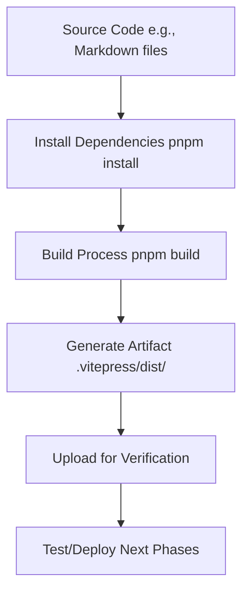

# Phase 2: Build - Automating Artifact Creation

<div class="phase-card">
  <div class="phase-header">
    <span class="phase-title">🔨 Build Phase</span>
    <span class="workshop-status status-progress">In Progress</span>
  </div>
  <p>Transform source code into deployable artifacts using automated builds</p>
</div>

## Learning Objectives

By the end of this phase, you will:
- ✅ Understand what build artifacts are
- ✅ Create a GitHub Actions workflow for automated builds
- ✅ Use pnpm for efficient dependency management
- ✅ Verify build outputs and artifacts

## Theory: Why the Build Phase Matters

### The Problem Without Automated Builds
Without automation, building a project involves manual steps:
- 🚨 Manual dependency installation on every machine
- 🚨 Inconsistent builds across different environments
- 🚨 No way to verify the build works before deployment
- 🚨 Time-consuming and error-prone process

### The DevOps Solution: Automated Builds

The Build phase supports **Automation** and **Lean** from the CALMS framework:



### Key Concepts

#### 1. What Are Build Artifacts?
Build artifacts are the compiled, production-ready files generated from your source code:
- **Source Code**: Human-readable files (Markdown, JavaScript, CSS)
- **Build Process**: Tools like VitePress transform source into optimized files
- **Artifacts**: The output files ready for deployment (HTML, CSS, JS bundles)
- **Why Artifacts?**: Source code is editable but slow/insecure for production; artifacts are optimized, secure, and consistent

#### 2. pnpm vs npm
- **pnpm**: Faster, more efficient package manager (3x faster installs)
- **npm**: Traditional package manager (slower, more disk usage)
- **Why pnpm?**: Uses content-addressable storage and symlinks for efficiency

#### 3. GitHub Actions for Builds
GitHub Actions automates the build process:
- **Triggers**: Runs on push to main or pull requests
- **Environment**: Consistent Ubuntu runners
- **Caching**: Speeds up repeated builds with pnpm cache
- **Artifacts**: Uploads build outputs for download and verification

## Hands-On Practice

### Step 1: Create the Build Workflow
<div class="step-counter">1</div>

Create the GitHub Actions workflow file to automate your build:

1. **Create the workflow directory and file**

   ```bash
   mkdir -p .github/workflows
   touch .github/workflows/ci.yml
   ```

2. **Add the build workflow content**

   ```yaml
   name: CI/CD Pipeline
   on:
     push:
       branches: [ main ]
     pull_request:
       branches: [ main ]

   jobs:
     build:
       runs-on: ubuntu-latest
       steps:
         - name: Checkout code
           uses: actions/checkout@v4

         - name: Setup pnpm
           uses: pnpm/action-setup@v2
           with:
             version: 8

         - name: Setup Node.js
           uses: actions/setup-node@v4
           with:
             node-version: 18
             cache: 'pnpm'

         - name: Install dependencies
           run: pnpm install --frozen-lockfile

         - name: Build the site
           run: pnpm build

         - name: Upload build artifact
           uses: actions/upload-artifact@v4
           with:
             name: workshop-site
             path: .vitepress/dist/
   ```

   **Why this workflow?**
   - **Checkout**: Gets your code from GitHub
   - **pnpm setup**: Installs pnpm for fast dependency management
   - **Node setup**: Installs Node.js with pnpm cache for speed
   - **Install**: Uses frozen lockfile for consistent dependencies
   - **Build**: Runs `pnpm build` to generate the static site
   - **Upload**: Saves the built files as downloadable artifacts

### Step 2: Test the Build Locally
<div class="step-counter">2</div>

Before pushing to GitHub, test the build process locally:

```bash
# Ensure you're in the project root
cd devops-workshop-vitepress

# Install dependencies (if not already done)
pnpm install

# Run the build command
pnpm build
```

**Expected output:**
