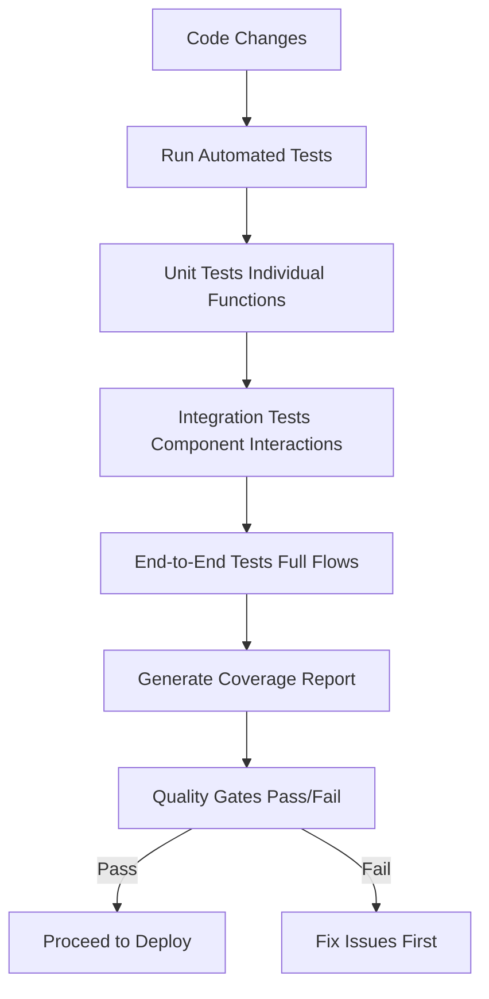

# Phase 3: Test - Ensuring Quality with Automated Testing

<div class="phase-card">
  <div class="phase-header">
    <span class="phase-title">🧪 Test Phase</span>
    <span class="workshop-status status-progress">In Progress</span>
  </div>
  <p>Ensure quality with automated testing and coverage reporting</p>
</div>

## Learning Objectives

By the end of this phase, you will:
- ✅ Understand different types of tests (unit, integration, E2E)
- ✅ Create automated tests for your workshop site
- ✅ Configure Jest for testing Markdown content
- ✅ Integrate tests into your CI/CD pipeline
- ✅ Understand test coverage and quality gates

## Theory: Why the Test Phase Matters

### The Problem Without Automated Testing
Without tests, software quality is hard to maintain:
- 🚨 Bugs can slip into production unnoticed
- 🚨 No confidence that changes don't break existing functionality
- 🚨 Manual testing is time-consuming and inconsistent
- 🚨 Refactoring becomes risky without safety nets

### The DevOps Solution: Automated Testing

The Test phase enables **Measurement** and **Lean** from the CALMS framework:



### Key Concepts

#### 1. Types of Tests
- **Unit Tests**: Test individual pieces of code in isolation
  - Fast and focused
  - Test small, specific functionality
  - Example: Does this function return the expected value?

- **Integration Tests**: Test how components work together
  - Verify interactions between modules
  - Slower than unit tests
  - Example: Does the build process generate correct files?

- **End-to-End (E2E) Tests**: Test the full application flow
  - Simulate real user interactions
  - Slowest but most comprehensive
  - Example: Can a user navigate the complete site?

#### 2. Test Coverage
Test coverage measures how much of your code is exercised by tests:
- **Line Coverage**: What percentage of code lines are executed?
- **Branch Coverage**: Are all decision paths (if/else) tested?
- **Function Coverage**: Are all functions called during tests?

**Why Coverage?**: High coverage (80%+) gives confidence that most code is tested, but it's not the only quality metric.

#### 3. Jest for Testing
Jest is a popular testing framework for JavaScript:
- **Fast**: Parallel test execution
- **Simple**: Easy to get started with
- **Powerful**: Built-in assertions, mocking, coverage
- **Node.js Friendly**: Perfect for testing Node.js projects

For our VitePress site, we'll use Jest to test:
- Markdown content validation
- File existence and structure
- Basic functionality checks

## Hands-On Practice

### Step 1: Install Jest
<div class="step-counter">1</div>

First, add Jest as a dev dependency to your project:

```bash
# Add Jest and testing utilities
pnpm add -D jest @types/jest

# Create the test configuration
touch jest.config.js
```

### Step 2: Configure Jest
<div class="step-counter">2</div>

Create the Jest configuration file `jest.config.js`:

```javascript
// jest.config.js
module.exports = {
  testEnvironment: 'node',  // Use Node.js environment for file system tests
  collectCoverage: true,    // Generate coverage reports
  coverageDirectory: 'coverage',  // Where to save coverage reports
  coverageReporters: ['text', 'lcov', 'html'],  // Multiple report formats
  coverageThreshold: {
    global: {
      branches: 80,      // 80% branch coverage
      functions: 80,     // 80% function coverage
      lines: 80,         // 80% line coverage
      statements: 80     // 80% statement coverage
    }
  },
  testMatch: ['**/tests/**/*.test.js'],  // Test file pattern
  testTimeout: 10000,  // 10 second timeout for tests
  verbose: true  // Show detailed test output
};
```

**Why this configuration?**
- **Node environment**: Allows file system access for testing Markdown files
- **Coverage collection**: Tracks which code is tested
- **Multiple reporters**: Text for console, HTML for browser viewing
- **Coverage thresholds**: Fails the build if coverage drops below 80%
- **Test pattern**: Runs all files ending with `.test.js` in tests folder

### Step 3: Create Test Directory and Files
<div class="step-counter">3</div>

Set up the test structure:

```bash
# Create tests directory
mkdir -p tests

# Create the main test file
touch tests/site.test.js
```

### Step 4: Write Your First Tests
<div class="step-counter">4</div>

Create `tests/site.test.js` with comprehensive tests for your workshop site:

```javascript
// tests/site.test.js
const fs = require('fs');
const path = require('path');

describe('Workshop Site Content Validation', () => {
  const docsDir = path.join(__dirname, '../docs');

  // Test 1: Verify all phase documentation pages exist
  test('All phase documentation pages exist', () => {
    const phaseFiles = [
      'phases/01-code.md',
      'phases/02-build.md',
      'phases/03-test.md',
      'phases/04-release.md',
      'phases/05-deploy.md'
    ];

    phaseFiles.forEach(file => {
      const fullPath = path.join(docsDir, file);
      expect(fs.existsSync(fullPath)).toBe(true);
      const content = fs.readFileSync(fullPath, 'utf8');
      expect(content.length).toBeGreaterThan(500);  // Ensure substantial content
    });
  });

  // Test 2: Verify progress tracker page has required structure
  test('Progress page has required structure', () => {
    const progressPath = path.join(docsDir, 'progress.md');
    expect(fs.existsSync(progressPath)).toBe(true);
    
    const content = fs.readFileSync(progressPath, 'utf8');
    expect(content).toContain('# Your Progress Tracker');
    expect(content).toContain('Phase Checklist');
    expect(content).toContain('| Phase | Status | Notes |');
    expect(content).toContain('Reflections');
  });

  // Test 3: Verify setup page has prerequisites section
  test('Setup page has prerequisites section', () => {
    const setupPath = path.join(docsDir, 'setup.md');
    expect(fs.existsSync(setupPath)).toBe(true);
    
    const content = fs.readFileSync(setupPath, 'utf8');
    expect(content).toContain('Prerequisites');
    expect(content).toContain('Node.js v18+');
    expect(content).toContain('pnpm');
    expect(content).toContain('Git');
  });

  // Test 4: Verify index page has workshop overview
  test('Index page has workshop overview', () => {
    const indexPath = path.join(docsDir, 'index.md');
    expect(fs.existsSync(indexPath)).toBe(true);
    
    const content = fs.readFileSync(indexPath, 'utf8');
    expect(content).toContain('DevOps Workshop');
    expect(content).toContain('CALMS framework');
    expect(content).toContain('Your Learning Journey');
  });

  // Test 5: Verify all theory pages have key sections
  test('Theory pages have key sections', () => {
    const theoryFiles = [
      'theory/code.md',
      'theory/build.md',
      'theory/test.md',
      'theory/release.md',
      'theory/deploy.md',
      'theory/cicd.md'
    ];

    theoryFiles.forEach(file => {
      const fullPath = path.join(docsDir, file);
      if (fs.existsSync(fullPath)) {
        const content = fs.readFileSync(fullPath, 'utf8');
        expect(content).toContain('What is the');
        expect(content).toContain('Key Concepts');
        expect(content).toContain('Hands-On');
        expect(content).toContain('Why');
      }
    });
  });

  // Test 6: Verify resource pages exist
  test('Resource pages exist', () => {
    const resourceFiles = [
      'resources/troubleshooting.md',
      'resources/extensions.md',
      'resources/feedback.md'
    ];

    resourceFiles.forEach(file => {
      const fullPath = path.join(docsDir, file);
      expect(fs.existsSync(fullPath)).toBe(true);
    });
  });
});
```

**What these tests do:**
- **File existence**: Ensures all documentation files are present
- **Content validation**: Checks for key sections and content in each file
- **Structure verification**: Confirms the site has the expected organization
- **Coverage contribution**: Each test exercises different parts of the codebase

### Step 5: Test Locally
<div class="step-counter">5</div>

Run your tests locally to verify they work:

```bash
# Run all tests
pnpm test

# Run with coverage report
pnpm test --coverage
```

**Expected output:**
