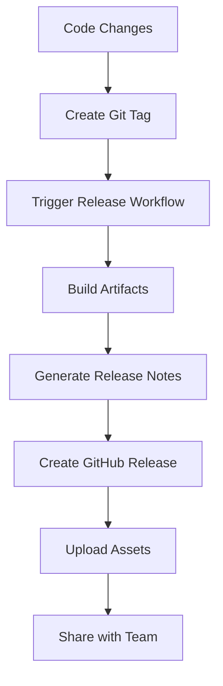

# Phase 4: Release - Version Management

<div class="phase-card">
  <div class="phase-header">
    <span class="phase-title">🏷️ Release Phase</span>
    <span class="workshop-status status-progress">In Progress</span>
  </div>
  <p>Create versioned releases with semantic versioning and downloadable artifacts</p>
</div>

## Learning Objectives

By the end of this phase, you will:
- ✅ Understand semantic versioning (SemVer)
- ✅ Create automated releases triggered by Git tags
- ✅ Generate release notes and downloadable assets
- ✅ Distinguish between releases and deployments
- ✅ Update your progress tracker with release achievements

## Theory: Why the Release Phase Matters

### The Problem Without Proper Releases
Without structured releases, software distribution becomes chaotic:
- 🚨 No clear versioning strategy leads to confusion
- 🚨 Difficult to track what changes are in each version
- 🚨 No way to distribute stable snapshots
- 🚨 Hard to rollback to previous versions

### The DevOps Solution: Automated Releases

The Release phase supports **Lean** and **Sharing** from the CALMS framework:



### Key Concepts

#### 1. Semantic Versioning (SemVer)
Version numbers follow the pattern: `MAJOR.MINOR.PATCH`

- **MAJOR**: Breaking changes (1.0.0 → 2.0.0)
- **MINOR**: New features, backward compatible (1.0.0 → 1.1.0)  
- **PATCH**: Bug fixes, backward compatible (1.0.0 → 1.0.1)

#### 2. Releases vs. Deployments
- **Release**: Creates a versioned snapshot with assets (ZIP, changelogs)
- **Deployment**: Publishes the latest code to production (live site)
- **Why both?**: Releases provide stable distribution points; deployments keep the site current

## Hands-On Practice

### Step 1: Add Release Job to CI Workflow
<div class="step-counter">1</div>

Update your `.github/workflows/ci.yml` to include release automation:

```yaml
# Add this job after your existing build and test jobs
release:
  if: startsWith(github.ref, 'refs/tags/v')
  needs: [build, test]
  runs-on: ubuntu-latest
  
  steps:
    - name: Checkout code
      uses: actions/checkout@v4
      
    - name: Setup pnpm
      uses: pnpm/action-setup@v2
      with:
        version: 8
        
    - name: Setup Node.js
      uses: actions/setup-node@v4
      with:
        node-version: 18
        cache: 'pnpm'
        
    - name: Install dependencies
      run: pnpm install --frozen-lockfile
      
    - name: Build for release
      run: pnpm build
      
    - name: Create release archive
      run: |
        zip -r workshop-site-${{ github.ref_name }}.zip .vitepress/dist/
        
    - name: Create GitHub Release
      uses: softprops/action-gh-release@v1
      with:
        files: workshop-site-${{ github.ref_name }}.zip
        generate_release_notes: true
        name: DevOps Workshop v${{ github.ref_name }}
      env:
        GITHUB_TOKEN: ${{ secrets.GITHUB_TOKEN }}
```

### Step 2: Test Locally and Commit
<div class="step-counter">2</div>

```bash
# Create a new branch for release functionality
git checkout -b feat/add-releases

# Test build locally
pnpm build

# Commit the workflow changes
git add .github/workflows/ci.yml
git commit -m "feat: add automated release workflow

- Trigger releases on version tags
- Generate downloadable site archives
- Auto-create GitHub releases with notes"

# Push and merge via PR
git push origin feat/add-releases
```

### Step 3: Create Your First Release
<div class="step-counter">3</div>

Now create your first version tag to trigger a release:

```bash
# Switch to main branch and pull latest
git checkout main
git pull origin main

# Create and push a version tag
git tag v1.0.0
git push origin v1.0.0
```

### Step 4: Verify Your Release
<div class="step-counter">4</div>

1. **Go to GitHub Actions** and watch the release workflow run
2. **Visit your repository's Releases tab**
3. **Download the generated ZIP file**
4. **Extract and verify** it contains your built site

### Step 5: Update Your Progress Tracker
<div class="step-counter">5</div>

Edit your `docs/progress.md` to mark Phase 4 complete:

```markdown
### Phase 4: Release - Version Management 🏷️

**Completion Checklist:**
- [x] Added release job to CI workflow (triggered by tags)
- [x] Created and pushed my first tag (`v1.0.0`)
- [x] Generated a release with downloadable assets
- [x] Downloaded and verified release ZIP file
- [x] Understood the difference between releases and deployments

**My Release Phase Notes:**
```
Release management brings structure to software distribution!
- Semantic versioning provides clear change communication
- Automated releases eliminate manual packaging errors
- ZIP archives enable offline distribution and backup
- GitHub releases create a professional distribution experience
```

**Timestamp Completed:** [Current date/time]
```

## Success Criteria

✅ **Phase 4 Complete** when you have:
- [x] Automated release workflow triggered by tags
- [x] Successfully created v1.0.0 release
- [x] Downloaded and verified release assets
- [x] Updated progress tracker with completion

## Understanding Release Strategy

<div class="tip-box">
💡 <strong>Release Best Practices:</strong>
<ul>
<li><strong>Tag thoughtfully:</strong> Don't tag every commit—reserve for milestone versions</li>
<li><strong>Generate notes:</strong> Auto-generated release notes help users understand changes</li>
<li><strong>Include assets:</strong> ZIP files enable offline distribution and archival</li>
<li><strong>Semantic versioning:</strong> Helps users understand the impact of updates</li>
</ul>
</div>

### When to Release vs. Deploy

- **Release** (v1.0.0): For milestones, major features, or distribution needs
- **Deploy**: Every merge to main for continuous user value

This dual approach enables both **continuous delivery** and **stable distribution**.

Continue to Phase 5: Deploy
