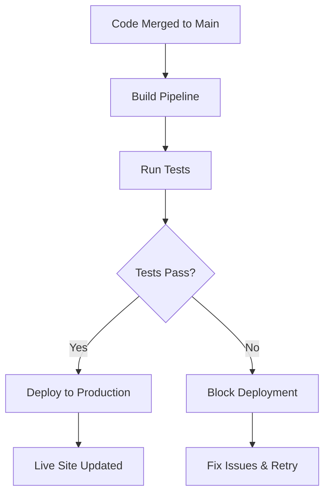

# Phase 5: Deploy - Production Automation

<div class="phase-card">
  <div class="phase-header">
    <span class="phase-title">🚀 Deploy Phase</span>
    <span class="workshop-status status-progress">Final Phase</span>
  </div>
  <p>Automatically deploy to production with GitHub Pages</p>
</div>

## Learning Objectives

By the end of this phase, you will:
- ✅ Implement automatic deployment to GitHub Pages
- ✅ Understand continuous deployment principles
- ✅ Experience the complete CI/CD pipeline
- ✅ Complete your DevOps workshop journey
- ✅ Finalize your progress tracker as a DevOps achievement

## Theory: Why the Deploy Phase Matters

### The Problem Without Automated Deployment
Manual deployment processes are error-prone and slow:
- 🚨 Manual steps lead to inconsistent deployments
- 🚨 Deployment becomes a bottleneck in the development process
- 🚨 Risk of human error in production releases
- 🚨 No automatic rollback capabilities

### The DevOps Solution: Continuous Deployment

The Deploy phase embodies **Automation** and **Lean** from the CALMS framework:



## Hands-On Practice: Complete Your CI/CD Pipeline

### Step 1: Add Deploy Job to Workflow
<div class="step-counter">1</div>

Add the deploy job to your `.github/workflows/ci.yml`:

```yaml
# Add this job after your existing jobs
deploy:
  if: github.ref == 'refs/heads/main' && github.event_name == 'push'
  needs: [build, test]
  runs-on: ubuntu-latest
  
  steps:
    - name: Checkout code
      uses: actions/checkout@v4
      
    - name: Setup pnpm
      uses: pnpm/action-setup@v2
      with:
        version: 8
        
    - name: Setup Node.js
      uses: actions/setup-node@v4
      with:
        node-version: 18
        cache: 'pnpm'
        
    - name: Install dependencies
      run: pnpm install --frozen-lockfile
      
    - name: Build site
      run: pnpm build
      
    - name: Deploy to GitHub Pages
      uses: peaceiris/actions-gh-pages@v3
      with:
        github_token: ${{ secrets.GITHUB_TOKEN }}
        publish_dir: .vitepress/dist
        cname: # Optional: add custom domain
```

### Step 2: Test the Full Pipeline
<div class="step-counter">2</div>

Let's test your complete CI/CD pipeline:

```bash
# Create a branch for final updates
git checkout -b feat/complete-pipeline

# Add the deploy job
git add .github/workflows/ci.yml

# Update your progress tracker to show completion
# Edit docs/progress.md and mark Phase 5 as complete

# Commit all changes
git commit -m "feat: complete CI/CD pipeline with deployment

- Added automated deployment to GitHub Pages
- Updated progress tracker with Phase 5 completion
- Ready for full pipeline test"

# Push and create PR
git push origin feat/complete-pipeline
```

### Step 3: Merge and Watch the Magic
<div class="step-counter">3</div>

1. **Create and merge your PR** to main
2. **Watch GitHub Actions** run the complete pipeline:
   - Build ✅
   - Test ✅  
   - Deploy ✅
3. **Visit your live site**: `https://[your-username].github.io/devops-workshop-vitepress/`

<div class="success-box">
🎉 <strong>DevOps Magic Moment:</strong> Your changes are now automatically live! Every future edit to main will build, test, and deploy automatically.
</div>

### Step 4: Celebrate and Document Your Achievement
<div class="step-counter">4</div>

Update your progress tracker one final time:

```markdown
### Phase 5: Deploy - Production Automation 🚀

**Completion Checklist:**
- [x] Added deploy job to CI workflow
- [x] Successfully deployed site to GitHub Pages
- [x] Verified live site at: https://[my-username].github.io/devops-workshop-vitepress/
- [x] Made a change and watched it deploy automatically
- [x] Completed the full CI/CD pipeline from code to production

**My Deploy Phase Notes:**
```
The complete DevOps transformation!
- Automated deployment eliminates manual errors
- Continuous delivery provides immediate user value  
- The full pipeline gives confidence in every change
- DevOps transforms how we deliver software
```

**Timestamp Completed:** [Current date/time]

## Final Workshop Reflection

### Overall Learning Summary
```
1. Biggest DevOps insight I gained:
   The power of automation to eliminate manual toil and enable faster, more reliable delivery

2. Most challenging part of the workshop:
   [Your experience - maybe understanding Git workflows or debugging pipeline issues]

3. How this changes my approach to software development:
   I now see the value of investing time in automation to save time later

4. What I want to implement at work/in personal projects:
   Automated testing and deployment pipelines for all my projects

5. Rating (1-10) and why:
   9/10 - Hands-on approach made DevOps concepts concrete and actionable
```
```

## Complete CI/CD Pipeline Achievement 🏆

**Final Site URL:** https://[your-username].github.io/devops-workshop-vitepress/
**Repository URL:** https://github.com/[your-username]/devops-workshop-vitepress  
**Completion Date:** [Today's date]

## What You've Accomplished

<div class="timeline">
  <div class="timeline-item">
    <h3>✅ Code Phase</h3>
    <p>Mastered Git workflows, branching, and Pull Requests</p>
  </div>
  <div class="timeline-item">
    <h3>✅ Build Phase</h3>
    <p>Automated artifact creation with GitHub Actions</p>
  </div>
  <div class="timeline-item">
    <h3>✅ Test Phase</h3>
    <p>Implemented quality gates with automated testing</p>
  </div>
  <div class="timeline-item">
    <h3>✅ Release Phase</h3>
    <p>Created versioned distributions with semantic versioning</p>
  </div>
  <div class="timeline-item">
    <h3>✅ Deploy Phase</h3>
    <p>Achieved continuous deployment to production</p>
  </div>
</div>

## Your DevOps Transformation

You've experienced the complete **CALMS** framework:

- **Culture**: Collaborative development through PRs and code review
- **Automation**: Full pipeline from code commit to production deployment
- **Lean**: Eliminated manual deployment toil and accelerated feedback  
- **Measurement**: Test coverage metrics and pipeline success tracking
- **Sharing**: Documentation and knowledge transfer through your progress tracker

## Next Steps: Continue Your DevOps Journey

<div class="phase-card">
  <div class="phase-header">
    <span class="phase-title">🚀 Beyond the Workshop</span>
    <span class="workshop-status status-complete">Ready to Scale</span>
  </div>
  <p>Take your new DevOps skills to the next level</p>
</div>

1. **Explore Extensions** - Add advanced features to your pipeline
2. **Share Your Achievement** - Add your site URL to the workshop chat
3. **Provide Feedback** - Help improve this workshop for others
4. **Apply to Real Projects** - Implement CI/CD in your work or personal projects

<div class="workshop-callout">
  <div class="workshop-callout-title">🎓 DevOps Certified!</div>
  <p>You've completed a full DevOps transformation journey. You understand not just the tools, but the culture and practices that make DevOps successful. Your live site and automated pipeline are proof of your new capabilities!</p>
</div>

**Congratulations! You're now a DevOps practitioner with real-world experience.**

---

*Your DevOps journey continues. Keep building, keep automating, keep improving!*
