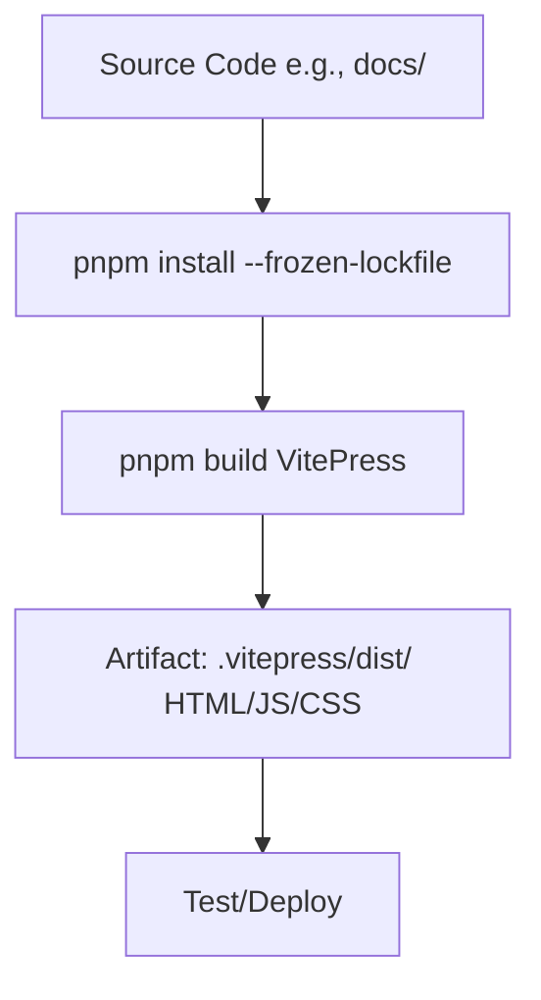

# Build Phase Theory

## What is the Build Phase?
Build transforms source into deployable artifacts. For VitePress: `pnpm build` generates static site (.vitepress/dist/: HTML/CSS/JS from Markdown). Automates compilation—key for reproducibility. In DevOps, supports Automation (pipelines) and Lean (fast builds); GitHub Actions handles caching for efficiency.

## Why Build Phase?
Source code (e.g., Markdown) is human-readable but not optimized for production. The Build phase creates a deployable **artifact**—a packaged, compiled, and optimized version of your application.

Think of an artifact as a ready-to-serve meal, whereas source code is just the raw ingredients. You can't serve ingredients to a customer; you must first cook and prepare them. Similarly, we build artifacts to create a consistent, fast, and secure version of our site for users. The artifact is what gets tested, versioned, and deployed.

## Key Concepts
- **pnpm Advantages**: Parallel installs, symlinks (3x faster than npm); lockfile ensures consistency (`--frozen-lockfile` in CI). Why lockfile? Prevents version mismatches (Measurement).
- **What is an Artifact?**: An artifact is the output of the build process. For this VitePress workshop, the artifact is the `.vitepress/dist/` directory. This folder contains all the static HTML, CSS, and JavaScript files that make up your live website. It's a self-contained, portable package that can be deployed to any web server.
- **VitePress Specifics**: Bundles assets, optimizes (chunking); pitfalls: Missing deps (check pnpm-lock.yaml), large files (Vite config: build.rollupOptions). Why optimize? Lean—reduces load times.

## Benefits & Maturity
Catches compile errors early; metrics: Build time <2 min. Level 2: Scripted builds; Level 3: Cached deps (Actions speeds this).

**Pitfalls**: Invalid config.js → Fail; fix locally first. Why? Ensures artifact is valid before pipeline (Lean).

Hands-On: /hands-on/code-build.md – Add build job to YAML! Reflection: Build creates artifact from code—next, test checks it.

### Artifacts
- For VitePress: `.vitepress/dist/` contains static files (HTML, CSS, JS).
- Uploaded as artifacts in CI for inspection or manual download.
- Pitfalls: Missing deps (check pnpm-lock.yaml), large bundles (optimize with Vite's chunking).

**Hands-On Tie-In**: In /hands-on/code-build.md, you'll create a workflow that builds and uploads this artifact.
