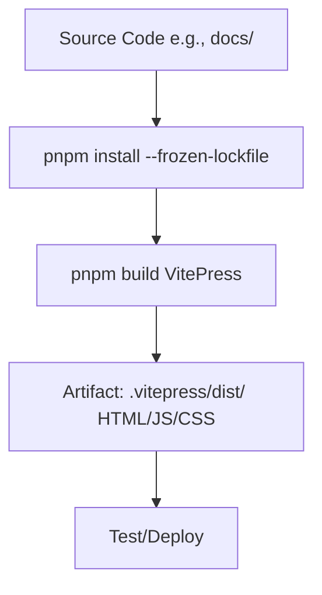

# Build Phase Theory

## What is the Build Phase?
Build transforms source into deployable artifacts. For VitePress: `pnpm build` generates static site (.vitepress/dist/: HTML/CSS/JS from Markdown). Automates compilation—key for reproducibility. In DevOps, supports Automation (pipelines) and Lean (fast builds); GitHub Actions handles caching for efficiency.

## Key Concepts
- **pnpm Advantages**: Parallel installs, symlinks (3x faster than npm); lockfile ensures consistency (`--frozen-lockfile` in CI).
- **Artifacts**: dist/ bundle; upload for inspection/download (e.g., verify offline).
- **VitePress Specifics**: Bundles assets, optimizes (chunking); pitfalls: Missing deps (check pnpm-lock.yaml), large files (Vite config: build.rollupOptions).

## Benefits & Maturity
Catches compile errors early; metrics: Build time <2 min. Level 2: Scripted builds; Level 3: Cached deps.

**Pitfalls**: Invalid config.js → Fail; fix locally first.

Hands-On: /hands-on/code-build.md – Add build job to YAML!
### Artifacts
- For VitePress: `.vitepress/dist/` contains static files (HTML, CSS, JS).
- Uploaded as artifacts in CI for inspection or manual download.
- Pitfalls: Missing deps (check pnpm-lock.yaml), large bundles (optimize with Vite's chunking).

**Hands-On Tie-In**: In /hands-on/code-build.md, you'll create a workflow that builds and uploads this artifact.
