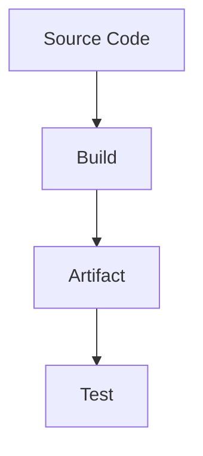

# Build Phase Theory

## What is the Build Phase?
The build phase compiles source code into deployable artifacts. For VitePress, this means generating the static site from Markdown.

## Key Concepts
- pnpm caching to speed up installs.
- Build artifacts for deployment.

## Detailed Explanation
The build phase is where your source code is transformed into a deployable format. In traditional software, this might involve compiling languages like Java or C++, but for web projects like VitePress, it's about bundling assets, optimizing images, and generating HTML from Markdown.

### pnpm Benefits
- **Speed**: Parallel downloads and symlinks reduce install time by up to 3x compared to npm.
- **Disk Efficiency**: Shared packages across projects.
- **Lockfile**: Ensures reproducible builds with `pnpm install --frozen-lockfile`.

### Artifacts
- For VitePress: `.vitepress/dist/` contains static files (HTML, CSS, JS).
- Uploaded as artifacts in CI for inspection or manual download.
- Pitfalls: Missing deps (check pnpm-lock.yaml), large bundles (optimize with Vite's chunking).

**Hands-On Tie-In**: In /hands-on/code-build.md, you'll create a workflow that builds and uploads this artifact.
