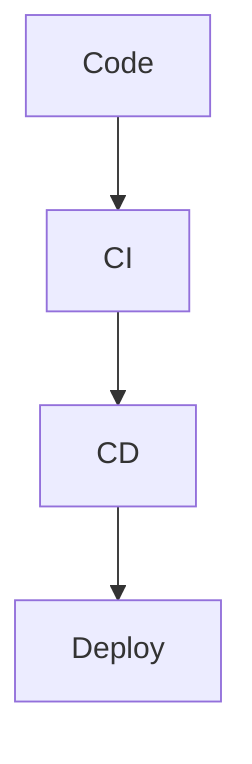

# CI/CD Overview Theory

## What is CI/CD?
Continuous Integration and Continuous Deployment automate the software delivery pipeline.

## Key Concepts
- Automation benefits.
- Pipeline as code.

## Detailed Explanation
CI/CD is the backbone of DevOps, enabling fast, reliable releases. CI merges and tests code frequently; CD deploys automatically.

### Continuous Integration (CI)
- Merge code often (daily).
- Run tests/builds on every push/PR.
- Tools: GitHub Actions, Jenkins.

### Continuous Deployment (CD)
- Auto-deploy to production after tests pass.
- Benefits: Faster feedback, fewer bugs.
- For VitePress: Deploy on main merges.

### Pipeline as Code
- YAML files define steps.
- Versioned with repo.
- Example: Our .github/workflows/ci-cd.yml.

**Maturity**: From manual (Level 1) to elite (Level 5: multiple deploys/day).

**Hands-On**: The entire workshop builds this pipeline.
