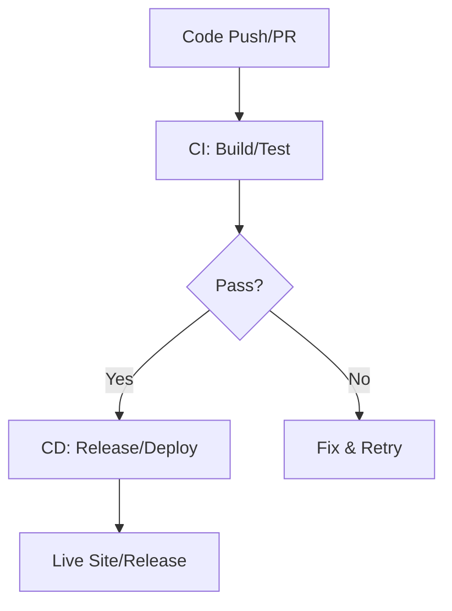

# CI/CD Overview Theory

## What is CI/CD?
Continuous Integration (CI) + Continuous Deployment (CD) automate delivery, core to DevOps (CALMS: Automation/Lean via pipelines; Measurement via metrics; ties to Culture/Sharing via reviews/PRs). CI: Merge/test frequently. CD: Deploy after pass. Backbone of DevOps—fast, reliable releases. We'll use GitHub Actions for practical automation of our phases. Basics: CI/CD turns manual steps (code→deploy) into automated flow, using artifacts (built files) as the "package" passed between phases.

## Why CI/CD?
CI/CD reduces errors/time: Without it, manual builds/deploy risk inconsistencies; with Actions, every change (from Code) builds an artifact, tests it, releases (if tagged), and deploys—measuring success (e.g., pass rates). Why tag in release? Builds happen often, but tags version artifacts for specific releases (milestones), enabling audits without halting deploys. Analogy: Assembly line—Code (parts) → Build (assemble) → Test (inspect) → Release (label) → Deploy (ship).

## Key Concepts
- **Automation Benefits**: Fewer bugs, faster feedback (DORA: Elite teams deploy 208x more via tools like Actions). Why? Lean—automates tedium.
- **Pipeline as Code**: YAML in repo (versioned, auditable); Actions excels here with reusable workflows. Why YAML? Tracks changes like code (Sharing).
- **Tools**: GitHub Actions (our focus: YAML for phases); Jenkins alternative. Why Actions? Free, integrated with GitHub for PR triggers.

## Detailed Phases
- CI: Daily merges; run on push/PR (our YAML with Actions). Builds artifact, tests it.
- CD: Auto-deploy to Pages on main; release on tags (versions artifact).
- For VitePress: Full cycle: Edit (Code) → Build (artifact) → Test (validate) → Deploy live + Release ZIP (tagged version). Actions enables Measurement (logs/metrics) and Sharing (badges/PRs).

## Maturity Model
Level 1: Manual (slow, error-prone). Level 5: Elite (multiple deploys/day). Workshop: Reach Level 3 (Actions-automated pipeline); discuss full CALMS (e.g., Culture via PRs). Why maturity? Guides improvement (Measurement).

Hands-On: Entire workshop builds this—start with /hands-on/code-build.md! Reflection: CI/CD automates from code to live site using artifacts/tags.
