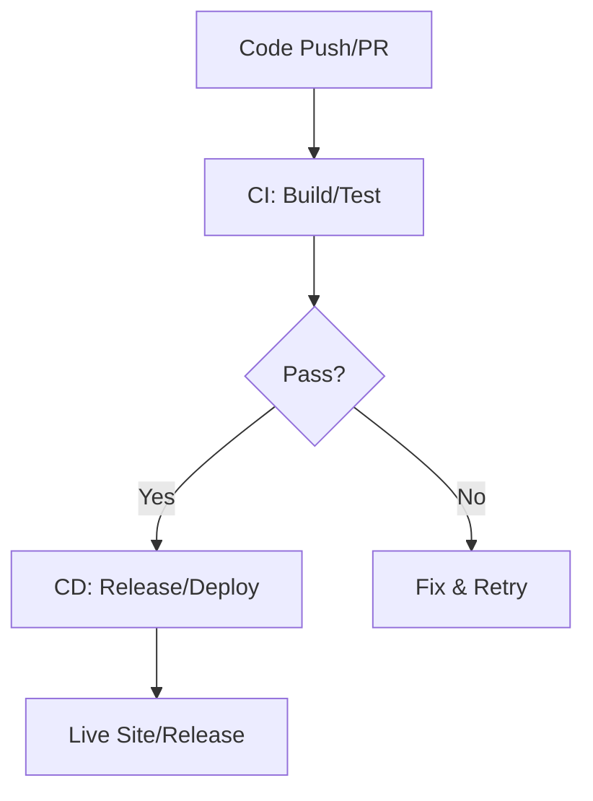

# CI/CD Overview Theory

## What is CI/CD?
Continuous Integration (CI) + Continuous Deployment (CD) automate delivery, core to DevOps (CALMS: Automation/Lean via pipelines; Measurement via metrics; ties to Culture/Sharing via reviews/PRs). CI: Merge/test frequently. CD: Deploy after pass. Backbone of DevOps—fast, reliable releases. We'll use GitHub Actions for practical automation of our phases.

## Key Concepts
- **Automation Benefits**: Fewer bugs, faster feedback (DORA: Elite teams deploy 208x more via tools like Actions).
- **Pipeline as Code**: YAML in repo (versioned, auditable); Actions excels here with reusable workflows.
- **Tools**: GitHub Actions (our focus: YAML for phases); Jenkins alternative.

## Detailed Phases
- CI: Daily merges; run on push/PR (our YAML with Actions).
- CD: Auto-deploy to Pages on main; release on tags.
- For VitePress: Full cycle: Edit → Build → Test → Deploy live + Release ZIP. Actions enables Measurement (logs/metrics) and Sharing (badges/PRs).

## Maturity Model
Level 1: Manual. Level 5: Elite (multiple deploys/day). Workshop: Reach Level 3 (Actions-automated pipeline); discuss full CALMS (e.g., Culture via PRs).

Hands-On: Entire workshop builds this—start with /hands-on/code-build.md!
