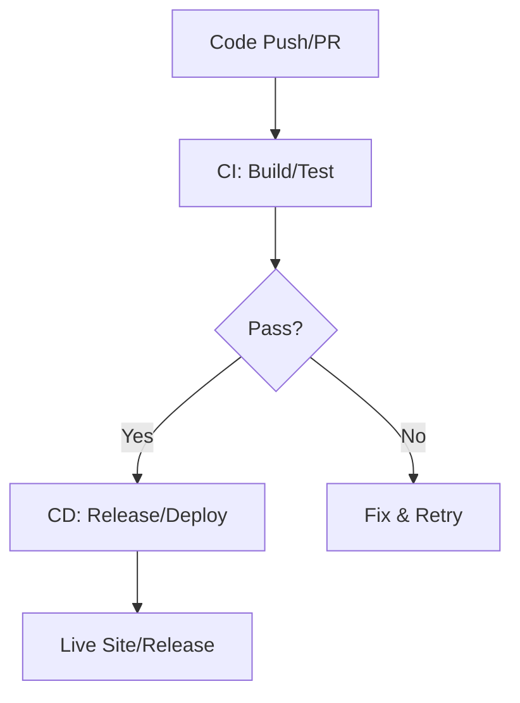

# CI/CD Overview Theory

## What is CI/CD?
Continuous Integration (CI) + Continuous Deployment (CD) automate delivery. CI: Merge/test frequently. CD: Deploy after pass. Backbone of DevOps—fast, reliable releases.

## Key Concepts
- **Automation Benefits**: Fewer bugs, faster feedback (DORA: Elite teams deploy 208x more).
- **Pipeline as Code**: YAML in repo (versioned, auditable).
- **Tools**: GitHub Actions (workflows); Jenkins alternative.

## Detailed Phases
- CI: Daily merges; run on push/PR (our YAML).
- CD: Auto-deploy to Pages on main; release on tags.
- For VitePress: Full cycle: Edit → Build → Test → Deploy live + Release ZIP.

## Maturity Model
Level 1: Manual. Level 5: Elite (multiple deploys/day). Workshop: Reach Level 3 (automated pipeline).

Hands-On: Entire workshop builds this—start with /hands-on/code-build.md!
