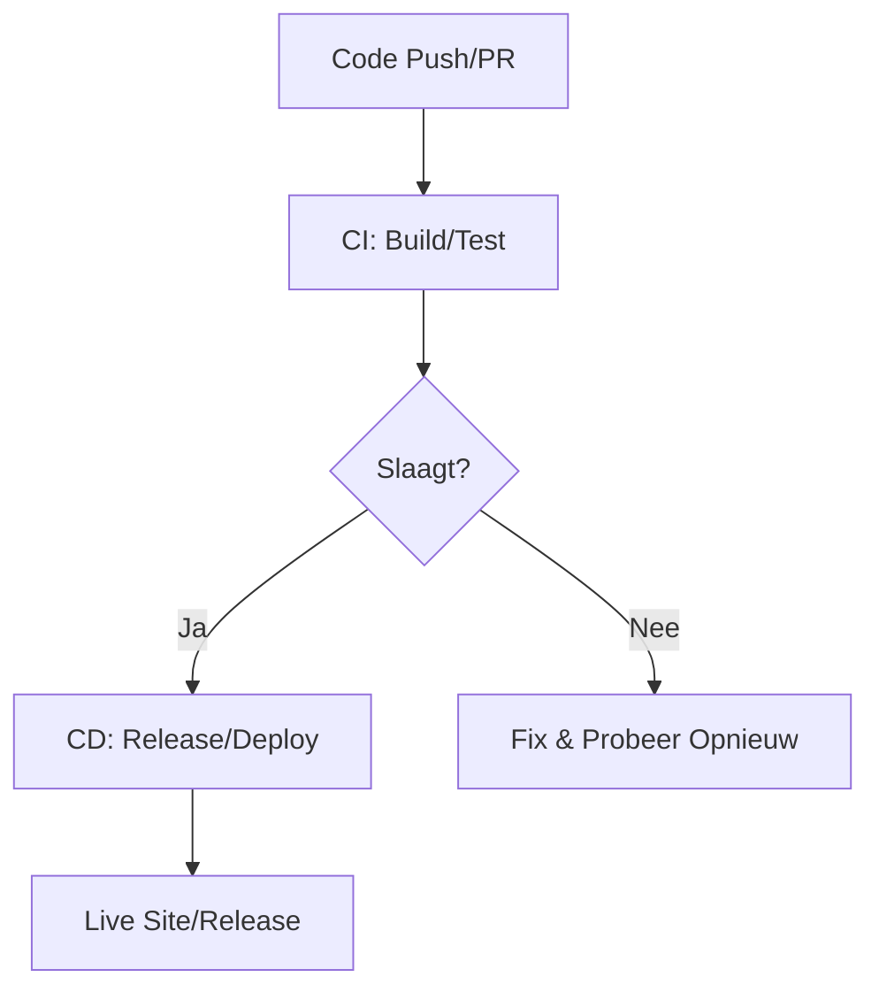

# CI/CD Overzicht Theorie

## Wat is CI/CD?

**Continuous Integration (CI) + Continuous Deployment (CD)** automatiseren softwarelevering en vormen de kern van DevOps.

### Definitie
- **CI (Continuous Integration)**: Automatisch code samenvoegen en testen bij elke wijziging
- **CD (Continuous Deployment)**: Automatisch deployen naar productie na succesvolle tests
- **Samen**: De ruggengraat van DevOps—snelle, betrouwbare releases

### CALMS Framework Verbinding
- **Automatisering**: Pipelines automatiseren handmatig werk
- **Lean**: Verminder verspilling door gestroomlijnde processen
- **Meting**: Track metrics zoals pass rates en deployment frequency
- **Cultuur**: PRs en code reviews bevorderen samenwerking
- **Delen**: Gedeelde pipelines en kennis via documentatie

## Waarom CI/CD?

### Het Probleem Zonder CI/CD
- 🚨 Handmatige builds en deployments zijn foutgevoelig
- 🚨 Inconsistenties tussen omgevingen
- 🚨 Trage feedback loops
- 🚨 Geen vertrouwen in releases

### De Oplossing Met CI/CD
Met GitHub Actions automatiseren we:
1. **Code** → Wijzigingen worden gecommit
2. **Build** → Artifact wordt gegenereerd
3. **Test** → Kwaliteit wordt gevalideerd
4. **Release** → Versie wordt getagd (bij milestones)
5. **Deploy** → Live site wordt bijgewerkt

**Waarom taggen bij release?** Builds gebeuren vaak, maar tags versioneren artifacts voor specifieke releases (milestones), wat audits mogelijk maakt zonder deployments te stoppen.

### Analogie
Denk aan een assemblagelijn:
- **Code**: Onderdelen verzamelen
- **Build**: Assembleren
- **Test**: Inspecteren
- **Release**: Labelen voor distributie
- **Deploy**: Verzenden naar klanten

## Kernconcepten

### 1. Automatisering Voordelen
- **Minder bugs**: Consistente processen
- **Snellere feedback**: Weet binnen minuten of iets werkt
- **DORA Metrics**: Elite teams deployen 208x vaker via automatisering

**Waarom?** Lean principe—automatiseer saai werk zodat mensen zich kunnen focussen op waarde creëren.

### 2. Pipeline as Code
- **YAML in repository**: Versioned en auditable
- **GitHub Actions**: Herbruikbare workflows
- **Voordeel**: Track pipeline wijzigingen zoals code (Delen principe)

**Waarom YAML?** Het is leesbaar, versioneerbaar en maakt pipelines reproduceerbaar.

### 3. Tools
- **GitHub Actions** (onze focus): Gratis, geïntegreerd met GitHub
- **Alternatieven**: Jenkins, GitLab CI, CircleCI

**Waarom Actions?** Gratis voor publieke repos, naadloze integratie met PRs en GitHub Pages.

## CI/CD Pipeline Visualisatie

## Gedetailleerde Fasen

### Continuous Integration (CI)
- **Trigger**: Bij elke push of PR
- **Acties**: 
  - Code checkout
  - Dependencies installeren
  - Build artifact genereren
  - Tests draaien
- **Doel**: Vroege feedback over code kwaliteit

### Continuous Deployment (CD)
- **Trigger**: Bij merge naar main (deploy) of tag (release)
- **Acties**:
  - **Deploy**: Automatisch naar GitHub Pages
  - **Release**: Creëer versioned ZIP bij tags
- **Doel**: Snelle waarde levering aan gebruikers

### Voor VitePress
Volledige cyclus:
1. **Edit** (Code fase) → Markdown bestanden wijzigen
2. **Build** (Build fase) → Genereer HTML/CSS/JS artifact
3. **Test** (Test fase) → Valideer content en structuur
4. **Deploy** (Deploy fase) → Publiceer naar live site
5. **Release** (Release fase) → Creëer versioned distributie

## DevOps Maturity Model

### Level 1: Handmatig
- Handmatige builds en deployments
- Traag en foutgevoelig
- Geen automatisering

### Level 2: Basis Automatisering
- Geautomatiseerde builds
- Handmatige deployments
- Enkele tests

### Level 3: CI/CD Pipeline (Workshop Doel)
- Volledige geautomatiseerde pipeline
- Geautomatiseerde tests
- Continuous deployment

### Level 4: Geavanceerd
- Multi-environment deployments
- Feature flags
- Canary releases

### Level 5: Elite
- Meerdere deployments per dag
- Volledige observability
- Self-healing systems

**Waarom maturity?** Het geeft een roadmap voor continue verbetering (Meting principe).

## Belangrijkste Voordelen

### Snelheid
- ⚡ Deployments in minuten in plaats van dagen
- ⚡ Snelle feedback loops
- ⚡ Snellere time-to-market

### Betrouwbaarheid
- ✅ Consistente builds
- ✅ Geautomatiseerde tests vangen bugs vroeg
- ✅ Rollback mogelijkheden

### Samenwerking
- 👥 PRs bevorderen code review
- 👥 Gedeelde pipeline kennis
- 👥 Transparante processen

### Meting
- 📊 Deployment frequency
- 📊 Lead time for changes
- 📊 Mean time to recovery
- 📊 Change failure rate

## Hands-On in Deze Workshop

Deze hele workshop bouwt een complete CI/CD pipeline:

1. **[Code Fase](/phases/01-code)** - Git workflows en PRs
2. **[Build Fase](/phases/02-build)** - Artifact generatie
3. **[Test Fase](/phases/03-test)** - Quality gates
4. **[Release Fase](/phases/04-release)** - Versioned distributies
5. **[Deploy Fase](/phases/05-deploy)** - Live deployment

**Start hier**: [Hands-on Code & Build](/hands-on/code-build)

## Reflectie

CI/CD transformeert hoe we software leveren:
- Van handmatig naar geautomatiseerd
- Van traag naar snel
- Van foutgevoelig naar betrouwbaar
- Van individueel naar collaboratief

**Kernboodschap**: CI/CD automatiseert de reis van code tot live site, met artifacts en tags als de sleutelconcepten die kwaliteit en traceerbaarheid waarborgen.
