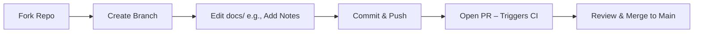

# Code Phase Theory

## What is the Code Phase?
In DevOps (CALMS framework), "Code" is the collaborative creation and versioning of source artifacts. It's the foundation: Write code, review via PRs, merge safely. For our VitePress site, "code" = Markdown in docs/ + configs/scripts—edits here trigger the pipeline, simulating real projects.

## Key Concepts & Best Practices

- **Git Workflow**: Fork > Feature branch (`git checkout -b feat-notes`) > Atomic commits (SemVer-inspired: "feat: add diagram") > PR for review > Merge to main.
- **Collaboration**: PRs enable code reviews, CI checks (e.g., lint on push). Tools: GitHub UI for diffs/comments.
- **VitePress Tie-In**: Source is .md files; lint with ESLint for Markdown (e.g., no broken links). Edits auto-preview in dev mode.
- **Automation Why?**: Manual merges risk errors; GitHub enforces branches/PRs. Metrics: Reduce cycle time (code to deploy) by 30–50%.
- **Real-World Analogy**: Like editing a shared Google Doc, but versioned—revert bad changes easily.
- **Edge Cases**: Conflicts (resolve in VS Code), large files (use .gitignore for builds).

## DevOps Maturity

- Level 1: Ad-hoc commits.
- Level 4: Automated linting/PR approvals (our workshop goal).

**Q&A Prompt**: How does this phase prevent "it works on my machine" issues?

Hands-On Next: /hands-on/code-build.md – Edit this theory page!
