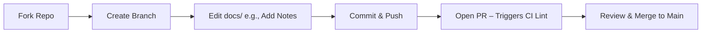

# Code Phase Theory

## What is the Code Phase?
In DevOps (CALMS framework), Code is the collaborative creation/versioning of artifacts. Foundation of the pipeline: Write/review/merge safely. Here, "code" = Markdown (docs/) + configs/scripts—your edits trigger CI/CD, simulating real projects. Goal: Prevent "it works on my machine" via version control. Ties to Culture (team PRs) and Sharing (knowledge via reviews); GitHub Actions automates PR checks.

## Key Concepts & Best Practices
- **Git Workflow**: Fork repo → Feature branch (`git checkout -b feat-add-notes`) → Atomic commits ("feat: update tracker" per SemVer) → PR for review/merge to main. Enforces collaboration.
- **PRs & Reviews**: GitHub UI: Diffs, comments, required checks (e.g., lint). Reduces errors by 30–50% (cycle time metric).
- **VitePress Integration**: Source = .md files; dev mode auto-previews. Lint Markdown (ESLint: no broken links). Ignore builds (.gitignore: dist/).
- **Automation Benefits**: Branches protect main; PRs trigger CI. Analogy: Shared doc with history/reverts.
- **Edge Cases**: Merge conflicts (resolve in VS Code); large files (gitignore node_modules/).

## DevOps Maturity
- Level 1: Ad-hoc pushes.
- Level 4: PR approvals + auto-lint (workshop target).

**Q&A**: How does Code prevent local-only issues? (A: PRs/CI test on clean env.)

Hands-On: /hands-on/code-build.md – Edit this page now!
**Q&A Prompt**: How does this phase prevent "it works on my machine" issues?

Hands-On Next: /hands-on/code-build.md – Edit this theory page!
