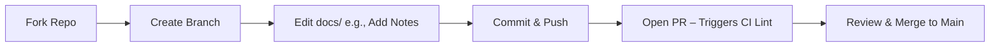

# Code Phase Theory

## What is the Code Phase?
In DevOps (CALMS framework), Code is the collaborative creation/versioning of source code. It's the foundation of the pipeline: Write/review/merge safely. Here, "code" = Markdown (docs/) + configs/scripts—your edits trigger CI/CD, simulating real projects. Goal: Prevent "it works on my machine" via version control. Ties to Culture (team PRs) and Sharing (knowledge via reviews); GitHub Actions automates PR checks.

## Why Code Phase?
Code ensures changes are tracked and reviewed—without it, teams risk errors from unversioned edits. Analogy: Like drafting a document collaboratively; Git (version control) saves history for easy undo/branching. In our workshop, editing Markdown (your source code) starts the flow; next, the **Build phase** transforms this source code into a deployable **artifact**.

## Key Concepts & Best Practices
- **Git Workflow**: Fork repo → Feature branch (`git checkout -b feat-add-notes`) → Atomic commits ("feat: update tracker" per SemVer) → PR for review/merge to main. Enforces collaboration. Why fork/branch? Allows safe experimentation without breaking main (Lean).
- **PRs & Reviews**: GitHub UI: Diffs (shows changes), comments (team feedback), required checks (e.g., lint). Reduces errors by 30–50% (cycle time metric). Why PRs? Promotes Culture—reviews catch issues before merge; Actions runs checks automatically.
- **VitePress Integration**: Source = .md files; dev mode auto-previews. Lint Markdown (ESLint: no broken links). Ignore builds (.gitignore: dist/). Why lint? Ensures clean code (Measurement).
- **Automation Benefits**: Branches protect main; PRs trigger CI. Analogy: Shared doc with history/reverts.
- **Edge Cases**: Merge conflicts (resolve in VS Code); large files (gitignore node_modules/). Why resolve conflicts? Keeps team aligned (Culture).

## DevOps Maturity
- Level 1: Ad-hoc pushes (risky, no reviews).
- Level 4: PR approvals + auto-lint (workshop target; enables Sharing).

**Q&A**: How does Code prevent local-only issues? (A: PRs/CI test on clean env—your local setup differs from production.)

Hands-On: /hands-on/code-build.md – Edit this page now! Reflection: After Code, we'll build an artifact (compiled version of your edits).
