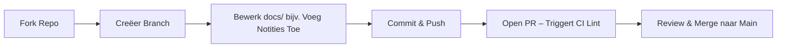

# Code Fase Theorie

## Wat is de Code Fase?

In DevOps (CALMS framework) is de **Code Fase** het collaboratieve proces van het creëren en versioneren van broncode. Het is het fundament van de pipeline: veilig schrijven, reviewen en mergen.

In deze workshop betekent "code":
- Markdown bestanden (`docs/*.md`)
- Configuratiebestanden (`.vitepress/config.js`)
- Scripts en workflows

**Doel**: Voorkom "het werkt op mijn machine" problemen door strikt versiebeheer.

**CALMS Verbinding**:
- **Cultuur**: Team PRs en samenwerking
- **Delen**: Kennisdeling via code reviews

## Waarom de Code Fase?

De Code fase zorgt ervoor dat wijzigingen worden bijgehouden en gereviewd. Zonder dit riskeren teams fouten door onbeheerde wijzigingen.

**Analogie**: Zie het als het samen schrijven van een belangrijk document. Git (versiebeheer) bewaart de geschiedenis zodat je altijd terug kunt of veilig kunt experimenteren in een kopie (branch).

In onze workshop start het bewerken van Markdown (jouw broncode) de flow; daarna transformeert de **Build fase** deze broncode naar een deploybaar **artifact**.

## Kernconcepten & Best Practices

### 1. Git Workflow
Het proces dat we volgen:
1. **Fork repo** → Je eigen kopie
2. **Feature branch** (`git checkout -b feat-add-notes`) → Veilig experimenteren
3. **Atomic commits** ("feat: update tracker") → Kleine, duidelijke wijzigingen
4. **Pull Request (PR)** → Voorstel om te mergen naar main

**Waarom forken/branchen?** Het stelt je in staat om veilig te experimenteren zonder de werkende code (main) te breken (Lean principe).

### 2. PRs & Reviews
GitHub UI biedt:
- **Diffs**: Toont precies wat er is gewijzigd
- **Comments**: Feedback van je team
- **Checks**: Geautomatiseerde controles (zoals linting)

**Impact**: Reviews verminderen fouten met 30–50%.
**Waarom PRs?** Het bevordert Cultuur—reviews vangen problemen voordat ze gemerged worden; Actions draait checks automatisch.

### 3. VitePress Integratie
- **Broncode**: `.md` bestanden
- **Dev Mode**: Auto-previews van je wijzigingen
- **Linting**: Controleert op fouten (bijv. gebroken links)

**Waarom linten?** Zorgt voor schone code (Meting principe).

### 4. Automatisering Voordelen
Branches beschermen de main code; PRs triggeren CI pipelines.

### 5. Edge Cases
- **Merge conflicts**: Wanneer twee mensen dezelfde regel wijzigen (oplossen in VS Code)
- **Grote bestanden**: Niet in git committen (gebruik `.gitignore`)

**Waarom conflicten oplossen?** Houdt het team op één lijn (Cultuur).

## DevOps Maturity

- **Level 1**: Ad-hoc pushes direct naar main (risicovol, geen reviews)
- **Level 2**: Basis branching
- **Level 3**: PRs met reviews
- **Level 4**: PR approvals + auto-lint (workshop doel; maakt Delen mogelijk)

## Visualisatie

## Q&A

**V: Hoe voorkomt de Code fase problemen die alleen lokaal optreden?**
A: PRs en CI testen de code op een schone omgeving (de build server). Als het daar werkt, werkt het waarschijnlijk overal, in tegenstelling tot je lokale setup die uniek kan zijn.

## Hands-On
Ga naar [Hands-on: Code & Build](/hands-on/code-build) om dit nu toe te passen!

**Reflectie**: Na de Code fase gaan we een **artifact** bouwen (een gecompileerde versie van je bewerkingen).
