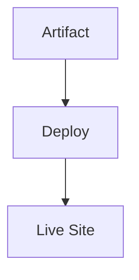

# Deploy Phase Theory

## What is the Deploy Phase?
Deployment makes the application available to users. For VitePress, this is publishing to GitHub Pages.

## Key Concepts
- Continuous deployment.
- Rollbacks.

## Detailed Explanation
Deployment is the final step, pushing the built artifact to production. For static sites, this is uploading to a hosting service.

### GitHub Pages
- Source: gh-pages branch or .github/workflows/.
- Action: peaceiris/actions-gh-pages pushes dist/ to gh-pages.
- URL: https://username.github.io/repo-name/.

### Continuous Deployment
- Trigger: Merge to main.
- Benefits: Instant updates, no manual steps.
- Security: Use GITHUB_TOKEN for auth.

### Rollbacks
- Revert commit or redeploy previous build.
- For Pages: Push old dist/ or use releases.

**Hands-On**: In /hands-on/deploy.md, you'll add the deploy job to the pipeline.
