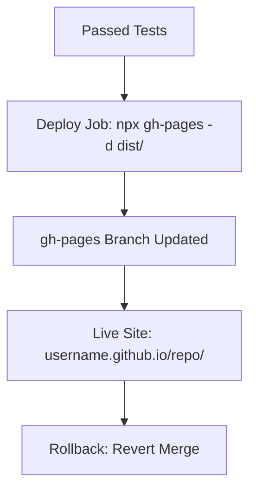

# Deploy Phase Theory

## What is the Deploy Phase?
Deployment publishes artifacts to production. For VitePress: Push dist/ to gh-pages branch → Live on GitHub Pages (https://username.github.io/repo/). In DevOps, embodies Automation (zero-touch via Actions) and Measurement (deploy success rates); integrates with sharing via live previews.

## Why Deploy Phase?
After Release versions the artifact, Deploy publishes it live—why? Makes validated/ versioned output accessible to users (e.g., site visitors). Why not just build? Artifacts need hosting; Pages auto-publishes for free. Rollbacks: Revert to prior artifact if issues arise (e.g., via tag ZIP). Analogy: Publishing a book after editing/printing—deploy is the "print run."

## Key Concepts
- **Continuous Deployment (CD)**: Auto after tests (trigger: main merge). Why continuous? Lean—frequent, small updates reduce risk.
- **GitHub Pages**: Free hosting; source = gh-pages. Action: peaceiris/actions-gh-pages. Why Pages? Simple for static sites like ours.
- **Security**: Use GITHUB_TOKEN (auto); no secrets needed for public. Why token? Secure automation (Automation).
- **Rollbacks**: Revert commit or redeploy old dist/. Why? Ensures reliability—if deploy fails, restore from Release artifact.

## Benefits
Instant updates; feedback loops. Maturity: Level 5 = Multiple deploys/day (track via Actions metrics).

Hands-On: /hands-on/deploy.md – Add deploy job! Reflection: Deploy publishes artifact—full pipeline: Code→Build→Test→Release→Deploy.
- Security: Use GITHUB_TOKEN for auth.

### Rollbacks
- Revert commit or redeploy previous build.
- For Pages: Push old dist/ or use releases.

**Hands-On**: In /hands-on/deploy.md, you'll add the deploy job to the pipeline.
