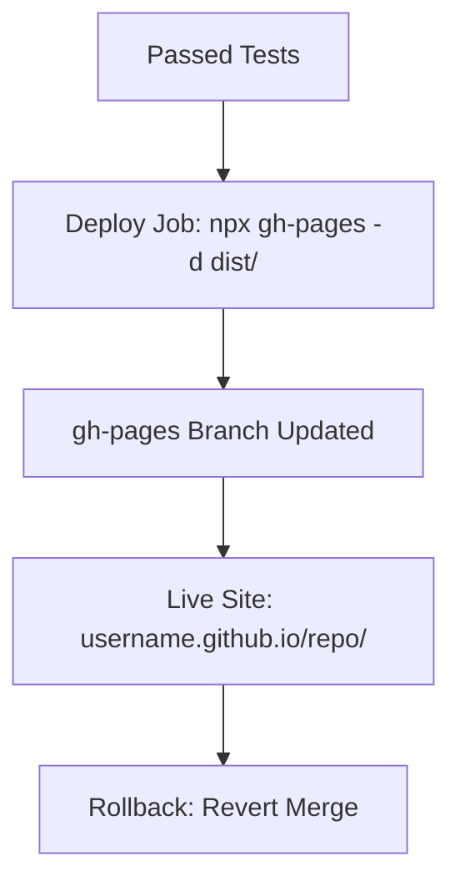

# Deploy Phase Theory

## What is the Deploy Phase?
Deployment publishes artifacts to production. For VitePress: Push dist/ to gh-pages branch → Live on GitHub Pages (https://username.github.io/repo/). In DevOps, embodies Automation (zero-touch via Actions) and Measurement (deploy success rates); integrates with sharing via live previews.

## Key Concepts
- **Continuous Deployment (CD)**: Auto after tests (trigger: main merge).
- **GitHub Pages**: Free hosting; source = gh-pages. Action: peaceiris/actions-gh-pages.
- **Security**: Use GITHUB_TOKEN (auto); no secrets needed for public.
- **Rollbacks**: Revert commit or redeploy old dist/.

## Benefits
Instant updates; feedback loops. Maturity: Level 5 = Multiple deploys/day.

Hands-On: /hands-on/deploy.md – Add deploy job!
### Continuous Deployment
- Trigger: Merge to main.
- Benefits: Instant updates, no manual steps.
- Security: Use GITHUB_TOKEN for auth.

### Rollbacks
- Revert commit or redeploy previous build.
- For Pages: Push old dist/ or use releases.

**Hands-On**: In /hands-on/deploy.md, you'll add the deploy job to the pipeline.
