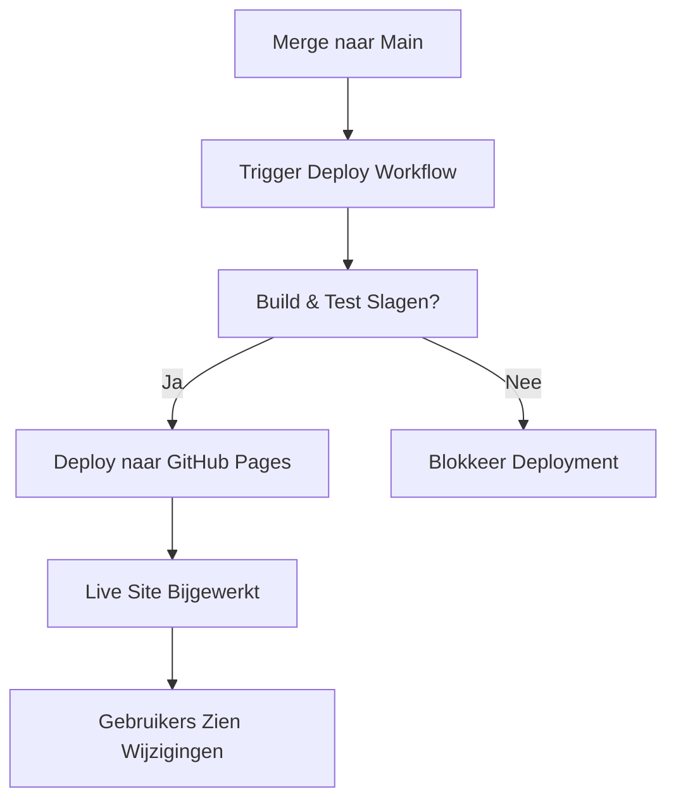

# Deploy Fase Theorie

## Wat is de Deploy Fase?

De **Deploy Fase** publiceert je geteste artifact naar productie (live omgeving).

In deze workshop:
- **Input**: Getest artifact
- **Trigger**: Merge naar main branch
- **Output**: Live website op GitHub Pages

**Doel**: Maak je software toegankelijk voor gebruikers.

**CALMS Verbinding**:
- **Automatisering**: Deployment zonder handmatige stappen
- **Lean**: Snelle feedback van echte gebruikers

## Waarom Deployen?

Zonder deployment:
- 🚨 Software blijft op de plank liggen
- 🚨 Geen gebruikersfeedback
- 🚨 Waarde wordt niet gerealiseerd

Met deployment:
- ✅ Gebruikers krijgen nieuwe features direct
- ✅ Snelle feedback loops
- ✅ Waarde wordt snel geleverd

**Analogie**: Deployment is zoals een product in de winkel zetten—het is gebouwd en getest, nu kunnen klanten het kopen.

## Kernconcepten

### 1. Continuous Deployment vs Delivery
- **Continuous Delivery**: Code is altijd klaar om te deployen (handmatige trigger)
- **Continuous Deployment**: Code wordt automatisch gedeployed bij elke merge

**Workshop**: We implementeren Continuous Deployment!

### 2. GitHub Pages
- Gratis static site hosting
- Automatisch HTTPS
- Geïntegreerd met GitHub
- Perfect voor VitePress

### 3. Deployment Strategie
- **Blue-Green**: Twee identieke omgevingen, switch tussen ze
- **Canary**: Geleidelijke rollout naar subset van gebruikers
- **Rolling**: Incrementele update van servers

**Workshop**: Directe deployment (GitHub Pages handelt dit af)

### 4. Rollback
Als deployment faalt of bugs introduceert:
- Revert de merge commit
- Deploy vorige versie
- Fix forward (nieuwe deployment met fix)

## DevOps Maturity

- **Level 1**: Handmatige FTP upload
- **Level 2**: Script-based deployment
- **Level 3**: Continuous deployment (workshop doel)
- **Level 4**: Multi-region, zero-downtime deployments

## Visualisatie

## Q&A

**V: Wat als deployment faalt?**
A: GitHub Pages toont de vorige versie. Fix de bug en deploy opnieuw.

**V: Hoe snel is deployment?**
A: Meestal 1-3 minuten na merge.

**V: Kunnen gebruikers downtime ervaren?**
A: Nee, GitHub Pages doet atomic deployments (oude versie → nieuwe versie zonder tussenstap).

## Hands-On
Ga naar Hands-on: Deploy om je deployment pipeline te voltooien!

**Reflectie**: Volledige CI/CD cyclus compleet: Code → Build → Test → Release → **Deploy** 🎉
