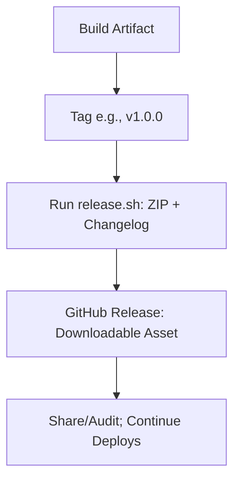

# Release Phase Theory

## What is the Release Phase?
Release creates versioned snapshots/artifacts. For VitePress: Orthogonal to deploy—tag for milestones (e.g., ZIP of dist/ for sharing), while CD keeps site live. In DevOps, promotes Lean (milestones without halting flow) and Sharing (artifacts for audits); GitHub Actions automates on tags.

## Why Release Phase?
Build creates artifacts every time, but Release versions them (e.g., v1.0.0 ZIP with changelog)—why not release every build? Tags mark significant updates (milestones) for tracking/rollback, avoiding version clutter; enables sharing (e.g., ZIP for offline review) without disrupting continuous deploys. Analogy: Saving document versions—tag for "final" shares. Next: Deploy publishes the latest artifact live.

## Key Concepts
- **Semantic Versioning (SemVer)**: MAJOR.MINOR.PATCH (e.g., 1.0.0). MAJOR: Breaks; MINOR: Features; PATCH: Fixes. Why SemVer? Clear change tracking (Measurement).
- **Artifacts**: ZIP dist/ + changelog; upload to GitHub Releases. Why ZIP? Portable snapshot of validated artifact (from Test).
- **Triggers**: Manual (`git tag v1.0.0; git push --tags`); Auto (semantic-release). Why manual first? Teaches control before automation.
- **VitePress Nuance**: Release = Snapshot (offline/audit); Deploy = Live (Pages). No pause: Deploy every merge, release on tags.

## Pros/Cons & Maturity
Pros: Offline access, rollbacks (use ZIP if deploy fails). Cons: Manual (automate for Level 5). Workshop: Tag post-test. Why? Practices versioning without over-versioning.

Hands-On: /hands-on/test-release.md – Create v1.0.0! Reflection: Released versioned artifact—next, deploy makes it live.
