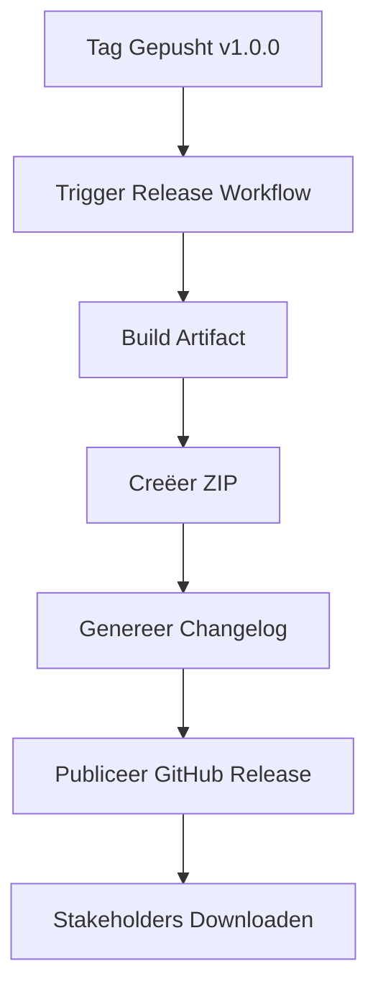

# Release Fase Theorie

## Wat is de Release Fase?

De **Release Fase** creëert versioned snapshots van je geteste artifact voor distributie.

In deze workshop:
- **Input**: Getest artifact
- **Trigger**: Git tag (bijv. `v1.0.0`)
- **Output**: GitHub Release met downloadbare ZIP

**Doel**: Stabiele, gedocumenteerde versies voor distributie en archivering.

**CALMS Verbinding**:
- **Delen**: Releases maken software toegankelijk voor stakeholders
- **Lean**: Geautomatiseerde release creatie

## Waarom Releasen?

Zonder releases:
- 🚨 Geen duidelijke versiegeschiedenis
- 🚨 Moeilijk om specifieke versies te distribueren
- 🚨 Geen rollback mogelijkheden

Met releases:
- ✅ Duidelijke versienummers
- ✅ Downloadbare snapshots
- ✅ Changelog documentatie
- ✅ Rollback naar eerdere versies

**Analogie**: Releases zijn zoals boek edities—v1.0 is de eerste druk, v1.1 is de herziene editie met correcties.

## Kernconcepten

### 1. Semantic Versioning (SemVer)
Formaat: `MAJOR.MINOR.PATCH`

- **MAJOR** (1.0.0 → 2.0.0): Breaking changes
- **MINOR** (1.0.0 → 1.1.0): Nieuwe features (backward compatible)
- **PATCH** (1.0.0 → 1.0.1): Bug fixes (backward compatible)

**Voorbeeld**:
- `v1.0.0`: Eerste stabiele release
- `v1.1.0`: Nieuwe feature toegevoegd
- `v1.1.1`: Bug fix
- `v2.0.0`: Breaking change

### 2. Git Tags
Tags markeren specifieke commits als releases.

```bash
git tag v1.0.0
git push origin v1.0.0
```

**Waarom tags?** Ze zijn onveranderlijk—een tag wijst altijd naar dezelfde code.

### 3. Release vs Deploy
- **Release**: Versioned snapshot (ZIP, changelog) voor distributie
- **Deploy**: Live site updaten

**Waarom beide?**
- Deploy vaak (elke merge naar main)
- Release spaarzaam (alleen bij milestones)

### 4. Release Assets
Downloadbare bestanden bij een release:
- ZIP van het artifact
- Changelogs
- Documentatie

## DevOps Maturity

- **Level 1**: Handmatige ZIP creatie en email
- **Level 2**: Handmatige GitHub releases
- **Level 3**: Geautomatiseerde releases bij tags (workshop doel)
- **Level 4**: Semantic release automation

## Visualisatie



## Q&A

**V: Waarom niet bij elke build een release?**
A: Releases zijn voor belangrijke milestones. Te veel releases creëren ruis. Deploys zijn voor frequente updates.

**V: Wat zit er in de release ZIP?**
A: Het gebouwde artifact (`.vitepress/dist/`)—klaar om te hosten op elke webserver.

## Hands-On
Ga naar Hands-on: Test & Release om je eerste release te maken!

**Reflectie**: Released artifact → nu klaar voor **Deploy** (automatisch live gaan).
