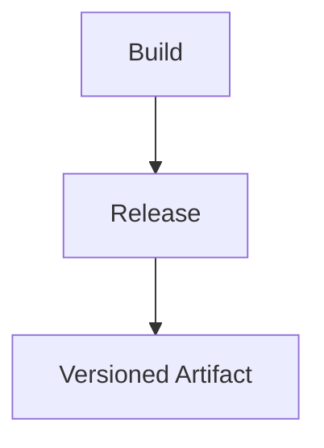

# Release Phase Theory

## What is the Release Phase?
Releasing creates versioned snapshots of the application. In VitePress, this is orthogonal to deployment.

## Key Concepts
- Semantic versioning.
- Artifacts like ZIP files.

## Detailed Explanation
Release is about creating milestones, separate from continuous deployment. For VitePress, a release packages the static site into a ZIP for sharing or archival.

### Semantic Versioning (SemVer)
- Format: MAJOR.MINOR.PATCH (e.g., 1.0.0).
- MAJOR: Breaking changes.
- MINOR: New features.
- PATCH: Bug fixes.

### Triggers
- Manual tags: `git tag v1.0.0 && git push --tags`.
- Automated: Tools like semantic-release.

### Artifacts
- ZIP of dist/ with changelog.
- Uploaded to GitHub Releases.
- Pros: Offline access, audits.
- Cons: Not live; use for demos or rollbacks.

**V2 Nuance**: Releases don't pause deploys—deploy every change, release on milestones.

**Hands-On**: In /hands-on/test-release.md, you'll tag and create a release.
