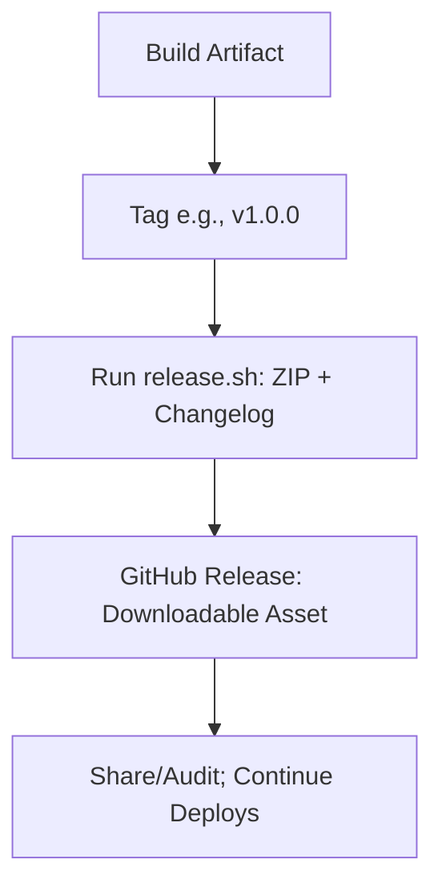

# Release Phase Theory

## What is the Release Phase?
Release creates versioned snapshots/artifacts. For VitePress: Orthogonal to deploy—tag for milestones (e.g., ZIP of dist/ for sharing), while CD keeps site live.

## Key Concepts
- **Semantic Versioning (SemVer)**: MAJOR.MINOR.PATCH (e.g., 1.0.0). MAJOR: Breaks; MINOR: Features; PATCH: Fixes.
- **Artifacts**: ZIP dist/ + changelog; upload to GitHub Releases.
- **Triggers**: Manual (`git tag v1.0.0; git push --tags`); Auto (semantic-release).
- **VitePress Nuance**: Release = Snapshot (offline/audit); Deploy = Live (Pages). No pause: Deploy every merge, release on tags.

## Pros/Cons & Maturity
Pros: Offline access, rollbacks. Cons: Manual (automate for Level 5). Workshop: Tag post-test.

Hands-On: /hands-on/test-release.md – Create v1.0.0!
