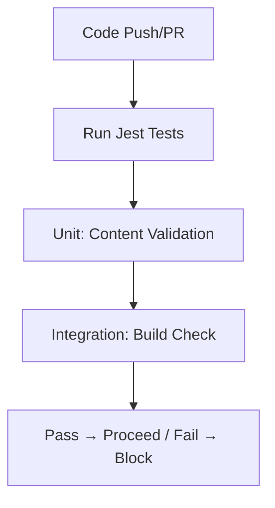

# Test Phase Theory

## What is the Test Phase?
Testing ensures quality/functionality; prevents regressions in CI/CD. Automated tests run per commit—failures block deploys. In DevOps, enables Measurement (coverage metrics) and Lean (early bug detection); GitHub Actions runs Jest on PRs/pushes.

## Why Test Phase?
After Build creates the artifact, Test validates it: Checks if compiled files work (e.g., content intact, no breaks). Why test? Artifacts must be reliable—unvalidated ones risk production errors (e.g., broken links). Analogy: Proofreading before printing; coverage measures thoroughness. Next: Release versions the validated artifact.

## Key Concepts
- **Types**: Unit (Jest: Individual checks, e.g., page content); Integration (Build + validate dist/ links); E2E (User flows, e.g., Playwright for site nav). Why types? Covers layers—from code logic to full site.
- **Jest for VitePress**: `pnpm test` validates Markdown (e.g., required sections). Coverage: `jest --coverage` (>80% threshold in jest.config.js). Why coverage? Quantifies tested parts (Measurement).
- **Thresholds**: Fail if <80% (config: coverageThreshold). Why fail? Enforces quality gates (Lean).

## Benefits
Catch bugs early; confidence in refactors. Metrics: Pass rate >95%. For site: Test for "What is?" in theory pages. Why metrics? Tracks DevOps health (e.g., fewer bugs over time).

**Edge**: Mock fs for CI (no real files). Why mock? Simulates production without dependencies.

Hands-On: /hands-on/test-release.md – Add site.test.js! Reflection: Test ensures artifact is solid—next, release tags it for milestones.
