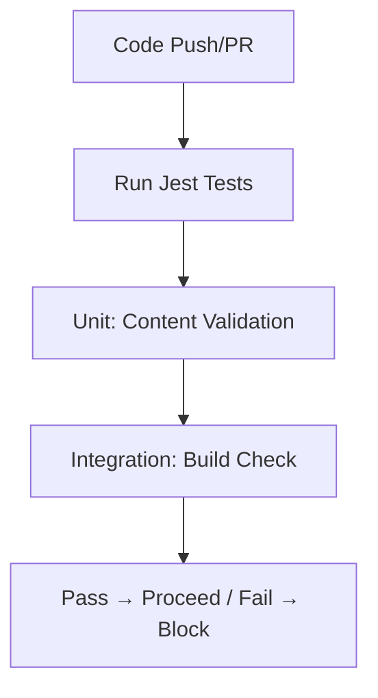

# Test Phase Theory

## What is the Test Phase?
Testing ensures quality/functionality; prevents regressions in CI/CD. Automated tests run per commit—failures block deploys.

## Key Concepts
- **Types**: Unit (Jest: Individual checks, e.g., page content); Integration (Build + validate dist/ links); E2E (User flows, e.g., Playwright for site nav).
- **Jest for VitePress**: `pnpm test` validates Markdown (e.g., required sections). Coverage: `jest --coverage` (>80% threshold in jest.config.js).
- **Thresholds**: Fail if <80% (config: coverageThreshold).

## Benefits
Catch bugs early; confidence in refactors. Metrics: Pass rate >95%. For site: Test for "What is?" in theory pages.

**Edge**: Mock fs for CI (no real files).

Hands-On: /hands-on/test-release.md – Add site.test.js!
- Run with `pnpm test`.
- Coverage: `jest --coverage` to see how much code is tested.
- Thresholds: Configure in jest.config.js to fail if coverage drops below 80%.

### Benefits
- Catch bugs early.
- Enable refactoring with confidence.
- Metrics: Track test pass rates in CI.

**Hands-On**: In /hands-on/test-release.md, you'll add tests and run them in the pipeline.
