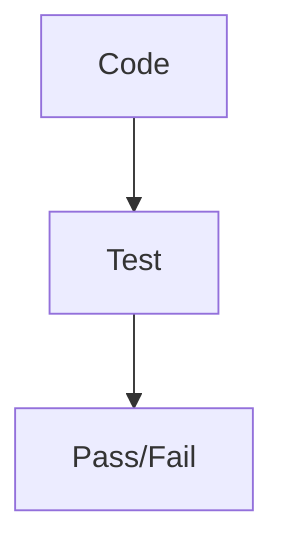

# Test Phase Theory

## What is the Test Phase?
Testing validates code quality and functionality. In CI/CD, automated tests prevent regressions.

## Key Concepts
- Unit tests with Jest.
- Coverage thresholds.

## Detailed Explanation
Testing is crucial in DevOps to ensure that changes don't break existing functionality. For our VitePress site, tests can validate that content is present and formatted correctly.

### Types of Tests
- **Unit Tests**: Test individual components, like checking if a page has required sections.
- **Integration Tests**: Test how parts work together, e.g., build and serve the site.
- **E2E Tests**: Simulate user interactions, but for static sites, this might involve checking links.

### Jest for VitePress
- Run with `pnpm test`.
- Coverage: `jest --coverage` to see how much code is tested.
- Thresholds: Configure in jest.config.js to fail if coverage drops below 80%.

### Benefits
- Catch bugs early.
- Enable refactoring with confidence.
- Metrics: Track test pass rates in CI.

**Hands-On**: In /hands-on/test-release.md, you'll add tests and run them in the pipeline.
