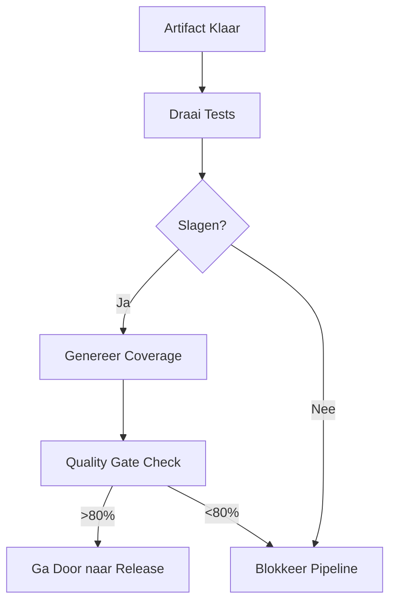

# Test Fase Theorie

## Wat is de Test Fase?

De **Test Fase** valideert dat je artifact (uit de Build fase) werkt zoals verwacht voordat het naar productie gaat.

In deze workshop:
- **Input**: Gebouwd artifact (`.vitepress/dist/`)
- **Proces**: Jest draait geautomatiseerde tests
- **Output**: Test resultaten + coverage rapport

**Doel**: Vang bugs vroeg, voordat gebruikers ze zien.

**CALMS Verbinding**:
- **Meting**: Coverage metrics tonen kwaliteit
- **Lean**: Geautomatiseerde tests geven snelle feedback

## Waarom Testen?

Zonder tests:
- 🚨 Bugs bereiken productie
- 🚨 Geen vertrouwen in wijzigingen
- 🚨 Refactoring wordt risicovol

Met tests:
- ✅ Vroege bug detectie
- ✅ Vertrouwen om te refactoren
- ✅ Documentatie van verwacht gedrag

**Analogie**: Tests zijn zoals kwaliteitscontrole in een fabriek—elk product wordt geïnspecteerd voordat het de deur uitgaat.

## Kernconcepten

### 1. Test Piramide
- **Unit Tests** (basis): Test kleine stukjes code in isolatie (snel, veel)
- **Integration Tests** (midden): Test hoe componenten samenwerken (medium snelheid, medium aantal)
- **E2E Tests** (top): Test volledige gebruikersflows (traag, weinig)

**Workshop focus**: Integration tests (bestaan bestanden? Bevat content de juiste secties?)

### 2. Test Coverage
Meet hoeveel code door tests wordt uitgevoerd:
- **Line Coverage**: % van code regels
- **Branch Coverage**: % van if/else paden
- **Function Coverage**: % van functies

**Doel**: >80% coverage (maar 100% coverage ≠ bug-vrij!)

### 3. Jest Framework
- **Snel**: Parallelle executie
- **Simpel**: Eenvoudige syntax (`expect(x).toBe(y)`)
- **Krachtig**: Ingebouwde mocking, coverage, watch mode

### 4. Quality Gates
Tests als poortwachter: als tests falen, stopt de pipeline.

**Waarom?** Voorkomt dat kapotte code naar productie gaat (Lean/Quality).

## DevOps Maturity

- **Level 1**: Handmatig testen (traag, inconsistent)
- **Level 2**: Enkele geautomatiseerde tests
- **Level 3**: Uitgebreide test suite in CI (workshop doel)
- **Level 4**: Test-driven development (TDD)

## Visualisatie

## Q&A

**V: Waarom testen we het artifact en niet de broncode?**
A: We willen weten of het *gebouwde* product werkt, niet alleen de broncode. Het build proces kan bugs introduceren.

**V: Wat als een test faalt?**
A: De pipeline stopt. Fix de bug of update de test, dan probeer opnieuw.

## Hands-On
Ga naar [Hands-on: Test & Release](/hands-on/test-release) om tests toe te voegen!

**Reflectie**: Getest artifact → klaar voor **Release** (versioneren) en **Deploy** (live gaan).
